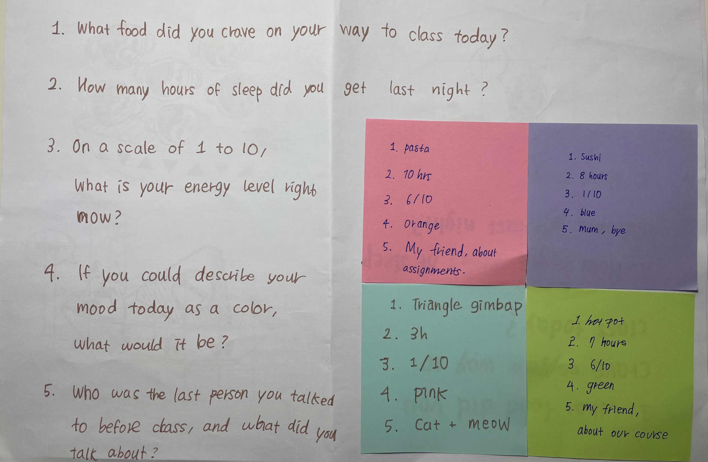

# Experiment 1: Data Drawings

[← Back to Home](../index.md)

## In-Class Activities 

**Overview:** In a group of 4–5 people, collect personal data from one another and collaborate on a hand-drawn data visualisation to produce a “group portrait” made entirely from data. Groups then swap their portraits and try to decode what each visualisation reveals about the people behind it.

---
### Step 1: Collect
Our group of four designed five questions to create a collective 'data portrait.' We wanted these questions to be personal yet approachable, moving beyond simple demographics to capture more human and specific details. Inspired by Giorgia Lupi, we crafted questions that allow our private stories to unfold, ensuring the data reflects empathy and imperfection rather than just cold numbers.

**The five questions our group came up with:**
1. Qualitative: What food were you thinking about on your way to class today?
2. Embodied: How many hours did you sleep last night?
3. Subjective: On a scale from 1 to 10, how would you rate your energy right now?
4. Playful: What colour represents your mood today?
5. Relational: Who was the last person you talked to before coming to class, and what did you talk about?

 

*(Figure 1. Initial data collection)*

---
### Step 2: Visualise
We developed a visual language based on the collected data, representing each group member metaphorically as a dining table. Each person’s five responses were visualised together within a single, defined space on paper, centred around a plate and its surrounding elements. This allowed viewers to quickly read and understand that person’s state and story at a glance. Rather than creating a simple chart, we aimed to produce a warm, narrative-driven illustration.

Data Legend:

- Food: Type of food craved on the way to class
- Plate Patterns: Number of patterns = Hours of sleep last night
- Food Quantity: Number of items = Energy level (Scale 1–10)
- Plate Colour: Reflects today's mood
- Person & Bubble: Last person spoken to and the conversation topic

 

*(Figure 2. Group portrait)*

---
### Step 3: Decode 

*(Figure 3. Other group portrait)*

 

**Content written on the Post-it notes:** 

**What can you learn about the people in this group from their data portrait?** 
Through the visualised symbols, we were able to identify basic everyday information about the group members, such as their age range, what time they went to sleep the night before, and the modes of transport they used to get to university. In particular, representing transportation using intuitive icons made it easy to visually understand each member’s commuting situation.

**What surprised you?** 
The most surprising element at first glance was the book symbol. Because it could be associated with many different meanings, I initially found it confusing and assumed it represented personal belongings or reading habits. However, after hearing the team’s explanation, the interpretation became unexpectedly refreshing. The number of visible page flips actually represented the number of classes each person had that day. Instead of simply using numbers, expressing this through turning pages felt like a clever and thoughtful piece of visual language design.

**What questions do you have for them?** 
When arranging the data, you ordered the elements as bus → car → person. Was there a specific reasoning or intention behind this visual sequence? For example, I’m curious whether it was meant to represent the temporal flow of the commuting process.

**Can you tell who is who?** 
To be honest, while the data itself was very intuitive and rich, making it easy to read, it was difficult to directly identify specific individuals. There was no clear way to match individual data points, such as “which person aged 21 went to bed at a certain time,” to a specific member.

 

---
 

## Independent Study: Data Portrait
**Overview:** Create your own data portrait: a hand-drawn visualisation of personal data collected over several days.

---
### Step 1: Choose a topic

Things we were curious about, but don’t usually pay attention to in daily life:

- How often we make eye contact with others in everyday situations
- How many people we talk to in a day
- How many times we feel hungry in a day
- Where do I space out the most?
- What we were doing while using our phones

I ultimately chose the question, 'Where do I space out the most?' because while it’s a frequent habit of mine, I had never thought to quantify it; by tracking this through Giorgia Lupi’s data humanism, I wanted to transform a repetitive, unconscious moment into a meaningful narrative of my daily life. This process allowed me to look beyond cold numbers and rediscover the human essence of data, capturing the subtle nuances and personal contexts that algorithms often overlook.

*(Figure 4. A Picture of My topic)*

---
### Step 2: Collect data by hand

During my four-day recording, I strove to be as specific and honest as possible, yet I faced many practical challenges. Most of all, there were many instances where I simply wasn't aware I was 'spacing out' in the moment, causing me to miss the timing or completely forget to log it. I also struggled with the ambiguity of the experience: for example, if I regained consciousness for just a second before drifting back into a daze, should that be counted as one continuous session or two? Ultimately, these gaps and difficulties in classification showed that our lives are far too imperfect to be as neatly defined as a simple algorithm.

 
*(Figure 5, 6. Raw Data: Recorded Instances of 'Spacing Out')*

 
*(Figure 7. Refined Data Visualization)*

---
### Step 3: Design your visualisation 

**Data Legend**

When: The clock serves as a canvas to record the specific time of each moment

Where: Gold: Outside | Black: Inside

How long: The fill level of the dot represents the duration of spacing out

- 1/4 filled: A fleeting moment (~10 sec)

- 1/2 filled: A brief pause (~30 sec)

- 3/4 filled: A noticeable daydream (1 min)

- Fully filled: Deep spacing out (2 min+)

 

*(Figure 8. Final 'Spacing Out' Visualisation)*

 

---
 

## Reflection

For my independent study, I chose the theme: Where do I space out the most? Although I was aware that I daze off frequently, I wanted to investigate which specific environments trigger my subconscious. This question aligns perfectly with the core of Giorgia Lupi’s Data Humanism. Rather than cold statistics that simply list numbers, this topic allowed me to capture my private daily life and its imperfect moments, weaving them into a single narrative.

The biggest challenge during the data collection was the ambiguity of data. I struggled with whether to view a split-second flicker of consciousness—where I briefly snapped out of it before drifting back—as a separate event or a continuous flow. Ultimately, I decided to treat these as overlapping experiences and recorded them as a single session. I also acknowledged that there were inevitably missing data points where I was not even aware I was spacing out. I believe these gaps and subjective judgements are precisely what make human data collection so fascinating, distinguishing it from mechanical data.

To ensure efficiency, I simplified locations into two categories: Inside and Outside. While I felt some regret about omitting specific place names such as cafes or classrooms, I chose to focus on core environmental differences to prevent the data encoding from becoming overly complex during the visualisation stage. By recording when and how long each session lasted, I made a surprising discovery: I space out for much longer than expected. Most of my sessions were deep immersions lasting over two minutes, contrary to my expectation of brief flickers. However, this could also mean that I only recognised the longer sessions, while the shorter ones remained unrecorded in my subconscious.

This exercise allowed me to personally experience the values of the Dear Data project—focussing on context rather than just quantity. Instead of just counting the number of times, I strove to include specific details like the setting and the depth of immersion. I realised that data is not a perfect answer sheet but a mirror reflecting the patterns of our lives. Recording my mental absence by hand provided a unique opportunity to rediscover the rhythms of my time and space that had previously gone unnoticed.
