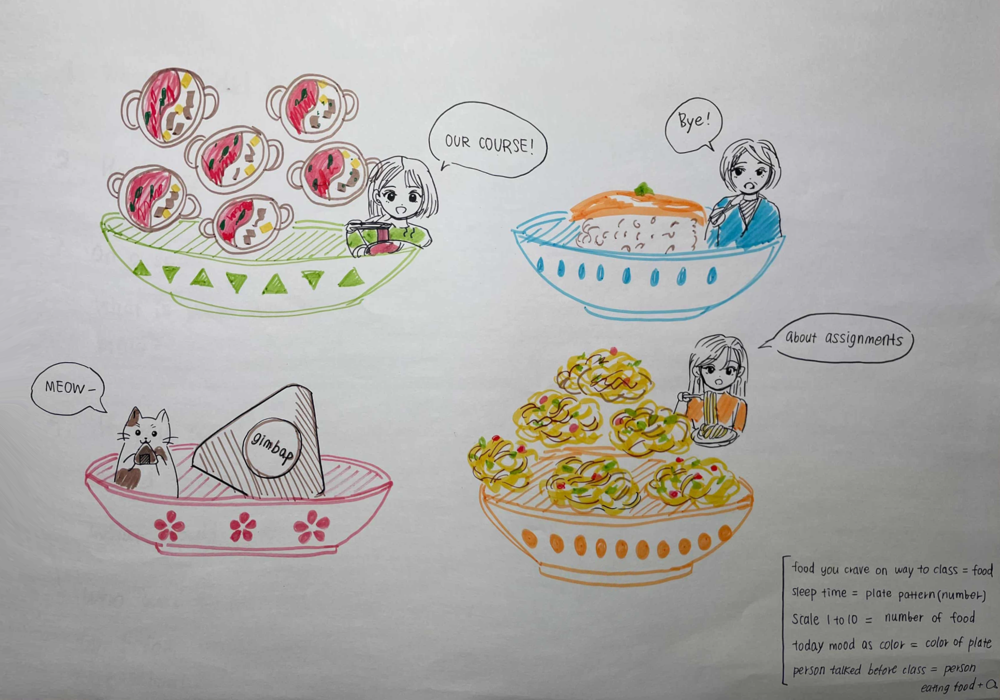
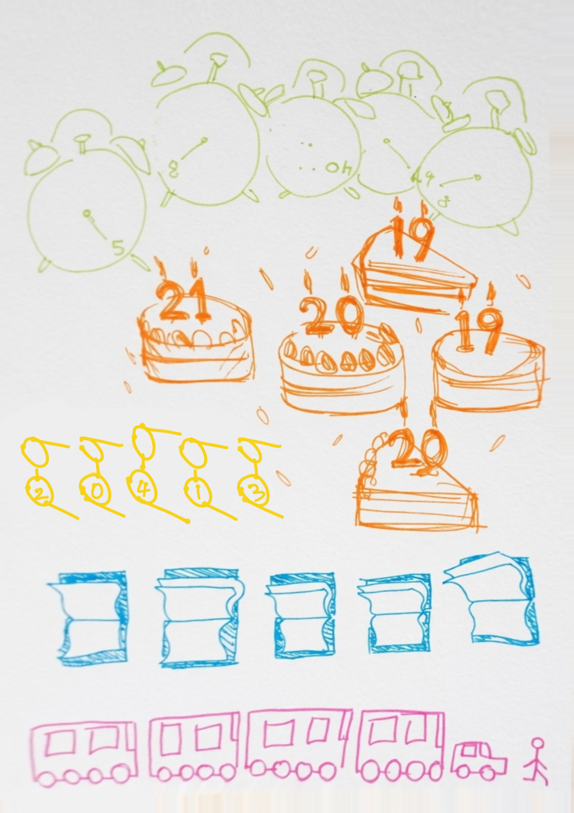

# Experiment 1: Data Drawings

[← Back to Home](../index.md)

 

## In-Class Activities 

**Overview:** In a group of 4–5 people, collect personal data from one another and collaborate on a hand-drawn data visualisation to produce a “group portrait” made entirely from data. Groups then swap their portraits and try to decode what each visualisation reveals about the people behind it.

---
### Step 1: Collect
I worked in a group of four and designed five questions to create a collective data portrait. Instead of focusing on basic demographics, we aimed to capture more human and specific aspects by creating questions that were personal but still easy to answer. Inspired by Giorgia Lupi, we wanted the questions to bring out personal stories, allowing the data to reflect empathy and imperfection rather than just cold numbers.

**The five questions our group came up with:**
1. Qualitative: What food were you thinking about on your way to class today?
2. Embodied: How many hours did you sleep last night?
3. Subjective: On a scale from 1 to 10, how would you rate your energy right now?
4. Playful: What colour represents your mood today?
5. Relational: Who was the last person you talked to before coming to class, and what did you talk about?

 

*(Figure 1. Initial data collection)*

---
### Step 2: Visualise
We developed a visual language based on the collected data, representing each group member metaphorically as a dining table. Each person’s five responses were visualised together within a single, defined space on paper, centred around a plate and its surrounding elements. This allowed viewers to quickly read and understand that person’s state and story at a glance. The goal was to create a warm, narrative-driven illustration instead of a simple chart.

Data Legend:

- Food: Type of food craved on the way to class
- Plate Patterns: Number of patterns = Hours of sleep last night
- Food Quantity: Number of items = Energy level (Scale 1–10)
- Plate Colour: Reflects today's mood
- Person & Bubble: Last person spoken to and the conversation topic

 

*(Figure 2. Group portrait)*

---
### Step 3: Decode 

*(Figure 3. Other group portrait)*

 

**Post-it note content:** 

**What can you learn about the people in this group from their data portrait?** 
Through the visualised symbols, I was able to identify basic information about each group member, including their age, hours of sleep last night, and how they got to class. The intuitive icons made the portraits easy to understand at a glance, allowing each person’s situation to be quickly interpreted.

**What surprised you?** 
The most surprising part for me was how they represented the book. I was initially confused because it could be interpreted in many different ways. However, after hearing the explanation, I realised that the turning pages of the book were used to show how many classes they had that day. I thought this was a really clever and creative idea.

**What questions do you have for them?** 
When arranging the data, you ordered the elements as bus → car → person. Was there a specific reasoning or intention behind this visual sequence?

**Can you tell who is who?** 
I found that while the data itself was intuitive and rich, making it easy to read, it was still difficult to clearly identify each individual. There wasn’t a clear way to match specific data points, such as which person was 21 or who went to bed at a certain time, to a particular group member.

 
 

## Independent Study: Data Portrait
**Overview:** Create your own data portrait: a hand-drawn visualisation of personal data collected over several days.

### Step 1: Choose a topic

What I tend to overlook in daily life:

- How often we make eye contact with others in everyday situations
- How many people we talk to in a day
- How many times we feel hungry in a day
- Where do I space out the most?
- What we were doing while using our phones

I ultimately chose the question, “Where do I space out the most?” because, although it’s something I do often, I had never thought to track or reflect on it. Using Giorgia Lupi’s approach to data humanism, I wanted to turn this repetitive, unconscious habit into a more meaningful narrative of my daily life. This process helped me move beyond cold numbers and focus on the human side of data, capturing subtle nuances and personal contexts that are often overlooked.

*(Figure 4. A Picture of My topic)*

---
### Step 2: Collect data by hand

I tried to record my data as accurately as possible over four days, but I think there were quite a few mistakes during the process. I faced several practical challenges, especially when I didn’t realise I was spacing out in the moment, which meant I either missed the timing or forgot to record it altogether. I also struggled with how to define the experience. For example, if I spaced out, then suddenly became aware, and then drifted off again, I wasn’t sure whether to count it as one instance or multiple. I decided to treat those moments as a single instance. Looking back at my data, most of my recorded episodes were over two minutes. I think this is because shorter moments were harder to notice, while longer ones were more likely to be recognised and remembered, especially when I briefly became aware and then drifted off again. Ultimately, these gaps and uncertainties made me realise that everyday experiences are far too imperfect to be neatly defined by a simple system or algorithm.

*(Figure 5, 6. Raw Data: Recorded Instances of 'Spacing Out')*

*(Figure 7. Refined Data Visualization)*

---
### Step 3: Design your visualisation 

**Data Legend**

When: The clock serves as a canvas to record the specific time of each moment

Where: Gold: Outside | Black: Inside

How long: The fill level of the dot represents the duration of spacing out

- 1/4 filled: A fleeting moment (10 sec)

- 1/2 filled: A brief pause (30 sec)

- 3/4 filled: A noticeable daydream (1 min)

- Fully filled: Deep spacing out (2 min+)

 

*(Figure 8. Final 'Spacing Out' Visualisation)*

 

## Reflection

I chose the theme “Where do I space out the most?” for my independent study. Although I was aware that I tend to zone out frequently, I wanted to explore which specific environments trigger this behaviour. This question aligns with the core ideas of Giorgia Lupi’s Data Humanism. Rather than relying on cold statistics that simply present numbers, this approach allowed me to capture moments from my daily life and turn them into a more personal and imperfect narrative.

The biggest challenge during data collection was the ambiguity of the experience itself. I struggled with how to interpret moments where I briefly became aware before drifting off again. It was unclear whether these should be recorded as separate events or as part of a continuous flow. In the end, I chose to treat them as a single session. I also recognised that there were likely many moments I failed to record, simply because I wasn’t aware I was spacing out at the time. These gaps and subjective decisions, however, are what make human data collection interesting, as they highlight the difference between lived experience and mechanical data.

I simplified locations into two categories, Inside and Outside, to keep the process manageable. Although I initially felt some hesitation about leaving out specific places like cafés or classrooms, I decided to focus on broader environmental differences to avoid overcomplicating the visualisation process. By recording when and how long each session lasted, I noticed something unexpected: I tend to space out for longer than I thought. Most of my sessions lasted over two minutes, rather than being brief moments. However, this may also suggest that I was more likely to notice and record longer episodes, while shorter ones went unnoticed.