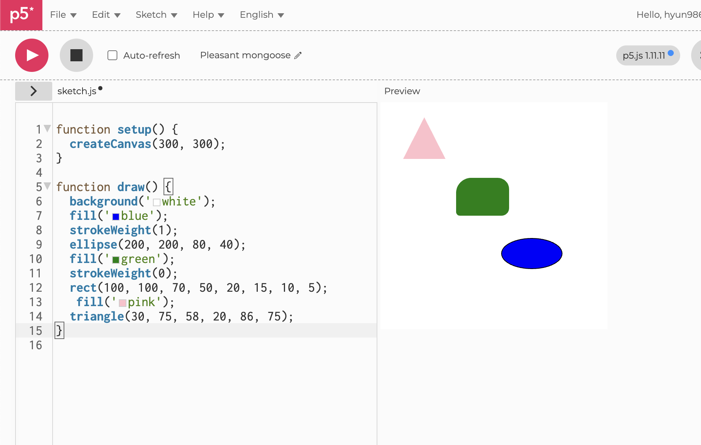
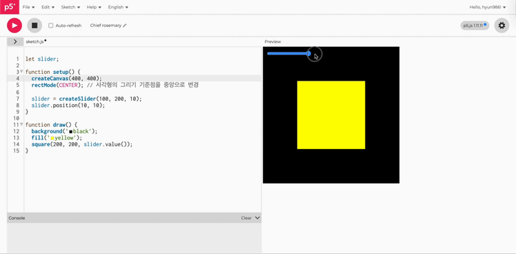
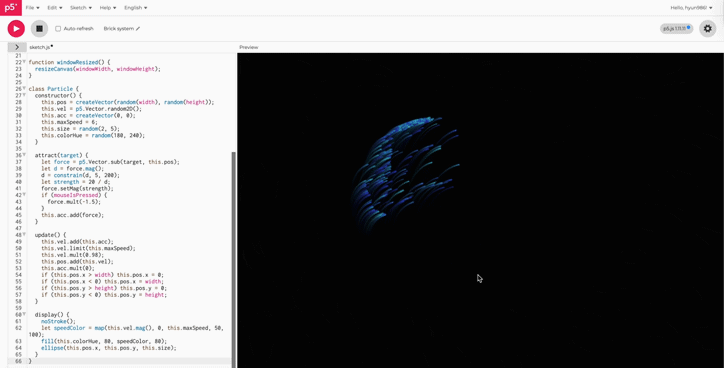
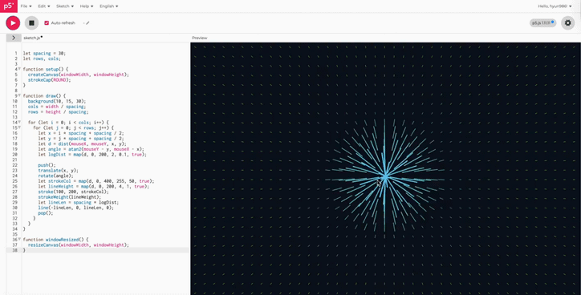
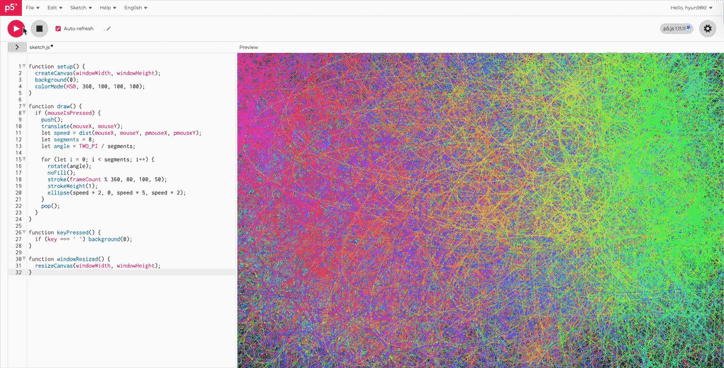
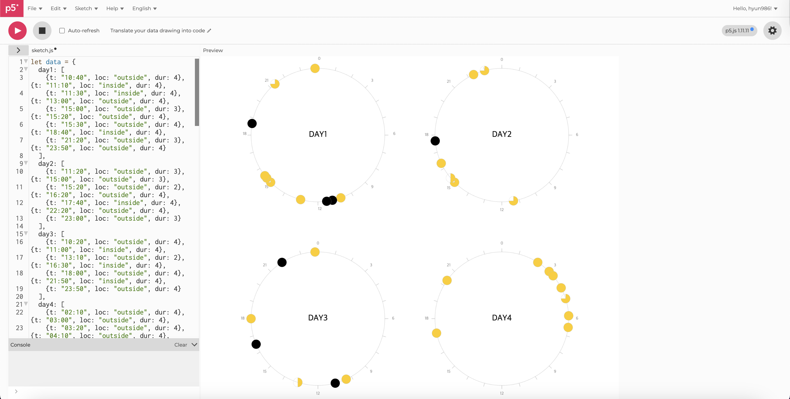
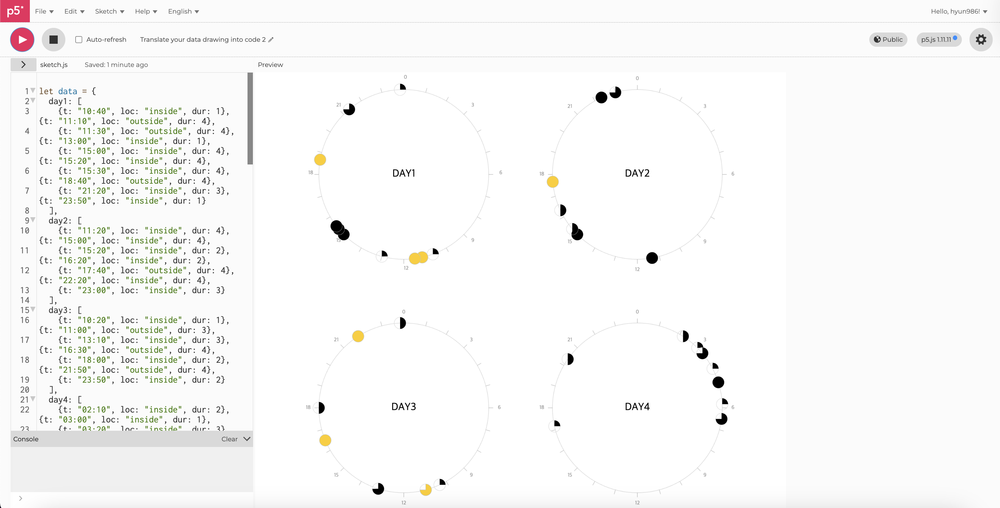
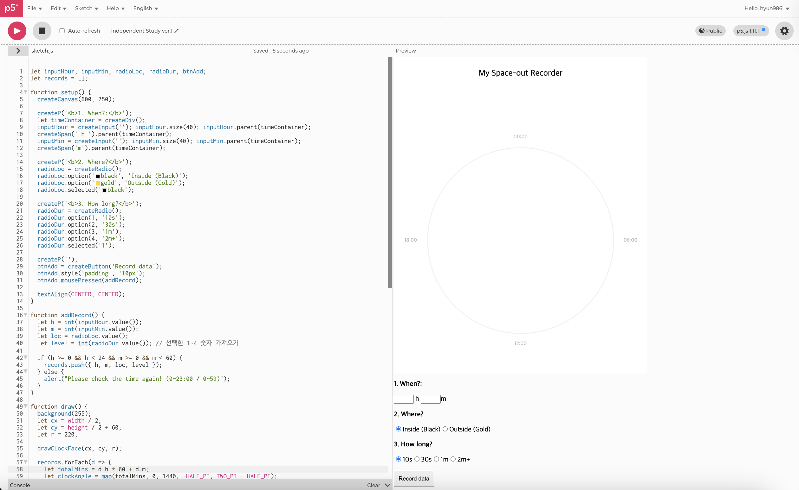
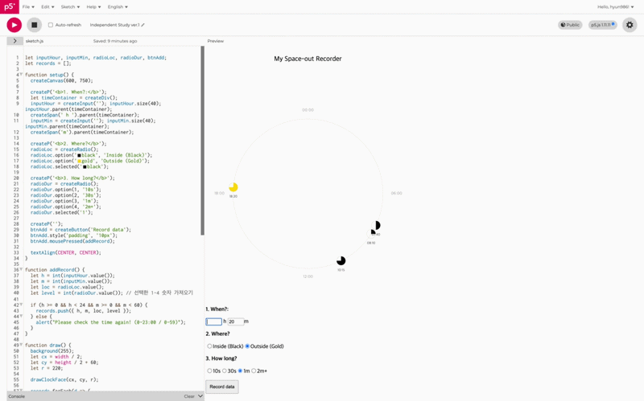
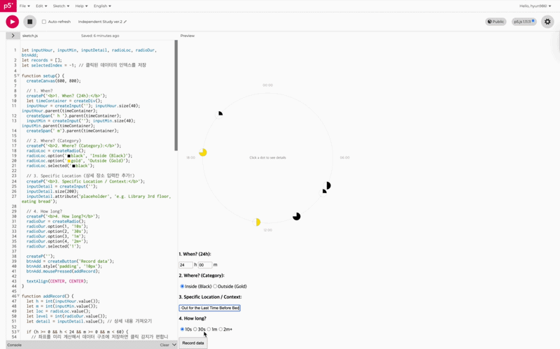

# Experiment 2: Interactivity

[← Back to Home](../index.md)

 

## In-Class Activities

**Overview:** Using p5.js, explore coding fundamentals and interactive DOM elements (buttons, sliders, text inputs) to create sketches that respond to user input. These activities build on the data drawing concepts from Experiment 1, shifting from physical to digital materials.

### Activity 1: Drawing with Code
#### Shapes

*(Figure 1. Screenshots of various sizes and shape experiments)*

#### Warm-up Exercises

*(Figure 2. Screenshots of warm-up experiments)*

In this exercise, I created forms on screen using simple numerical inputs and practised working with different shapes, colours, and outline strokes, while exploring how adjusting parameters affects visual outcomes. By using multiple arguments in the rect() function, I was able to round the corners, and by carefully aligning the three vertex coordinates in the triangle() function, I achieved more precise shapes. Although I initially struggled to estimate the (x, y) positions and had to repeatedly adjust the values, this process helped me develop a better sense of how code translates into visual scale and placement.

I also practised recreating the same shapes based on the example provided by the lecturer to better understand the p5.js canvas coordinate system. I found it particularly engaging in the first task, where I layered a yellow circle behind a green rectangle to create the effect of a sun setting over the horizon.

---

### Activity 2: Make an Interactive Sketch

#### Sliders

*(Figure 3. GIF of sliders adjusting shape sizes)*

#### Text Input

*(Figure 4. GIF of the text input window)*

#### Random Generation Button

*(Figure 5. GIF of the button generating random drawings)*

In this step, I learned how users can interact with the screen in real time by working with DOM elements such as createSlider(), createInput(), and createButton(). I practised using a slider to control the size of a rectangle, allowing it to change dynamically based on the slider’s position. I also used createInput() to display text instantly on the screen as I typed. Finally, I experimented with generating circles of random sizes and colours using the random() function.

---

### Activity 3: Vibe Code an Interactive Sketch

#### Dynamic Gravity Field

*(Figure 6. GIF of testing the Dynamic Gravity Field sketch)*

#### Organic Tendrils

*(Figure 7. GIF of testing the Organic Tendrils sketch)*

#### Spiral Geometric Brush

*(Figure 8. GIF of testing the Spiral Geometric Brush sketch)*

In this step, I used an LLM to help generate sketches that required more complex mathematical logic. I experimented with sketches where particles moved like organic forms following the mouse path (Organic Tendrils), transformed into colourful geometric spirals (Spiral Geometric Brush), and also explored a Dynamic Gravity Field sketch. Through this process, I realised that the LLM should not be used to simply generate finished code, but rather as a tool to support my thinking. I needed to step in, modify the code, and shape the outcome myself. This helped me understand the importance of using LLMs as a collaborator rather than relying on them completely.

 
 

## Independent Study: Interactive Data Portrait
**Overview:** Take the data you collected for Experiment 1 and use it as the basis for an interactive p5.js sketch. The challenge is to translate your hand-drawn data portrait into something a viewer can explore, control, or manipulate through interactive elements.

### Step 1: Translate your data drawing into code
In this stage, I converted the data drawing I created in Week 1 into p5.js code. Because I had already clearly defined the visualisation rules, I was able to translate them into code by providing the LLM (Gemini) with specific instructions, such as the “quarter fill” logic and the “24 hour coordinate system.”

There was some trial and error at the beginning, as the LLM did not fully understand my intentions. However, by continuously refining my prompts, I was able to achieve the logic I wanted. For parts of the generated code that did not fully match my original data, I manually analysed and adjusted the code to ensure it aligned with my initial drawing.

Through this process, I not only learned how to efficiently generate code using an LLM, but also developed a better understanding of code structure and how to adapt it to match my own design intentions.

 

*(Figure 9. Photo of the original data collected)*

*(Figure 10. My original data drawing)*

*(Figure 11. Initial data visualisation generated via LLM based on my records)*

*(Figure 12. Manual code adjustments and debugging to match the original intent)*

---
### Step 2: Design your interactive visualisation
In this stage, I used p5.dom to implement an interactive system that allows users to input and visualise their own spacing out data. I designed a text input for the time (When), radio buttons for the location (Where), and a dropdown menu to determine the duration (How long). The system is structured so that as soon as the 'Register' button is clicked, a data portrait is drawn onto the canvas in real-time. Once the information is submitted, the values are bundled into an Object and stored in an array; the program then reads this structure to render the visuals instantaneously.

*(Figure 13. Screenshot of my "Space-out Recorder" visualisation design)*

However, implementing these interactive features made me reflect on the limitations of the data simplification I used during the analogue recording stage. When drawing by hand, I reduced locations to just two categories, “Inside” and “Outside,” to keep the visuals clear and legible. Through this digital transition, I realised that a digital environment allows for “details on demand.” For example, I could have designed an interaction where the data appears as a simple circular segment at first, but reveals more specific information, such as “Library, 3rd floor” or “park bench,” along with the exact time when clicked. This would have allowed me to maintain visual clarity while also presenting richer data.

--- 

### Step 3: Iterate

I conducted a data validation step by asking a friend to provide a "spacing out" log to test my sketch’s framework. My goal was to improve upon earlier constraints, so I guided the data collection toward higher specificity. Instead of broad estimates, I gathered detailed information regarding the exact time, the specific environment, and the precise length of each episode. This shift toward detailed data points was essential in ensuring that the final visualization accurately reflected the nuances of the user's lived experience.

**My friend's data:**\
07:40 | Spacing out in a room on the bed (30 seconds)\
08:10 | Spacing out while eating in the kitchen (10 seconds)\
10:15 | Space out in the university classroom (1 minute)\
12:40 | Space out in front of the cafe counter (30 seconds)\
18:20 | Spacing out listening to a song at the bus stop on the way home (1 minute)\
20:45 | Space out while doing assignments in the room (10 seconds)\
24:00 | On the Bed, Spacing Out for the Last Time Before Bed (30 Seconds)

 

*(Figure 14. GIF of the "Space-out" data visualisation)*

I experienced several technical challenges before finalising the visualisation code. One major issue was that the fill amount of the circles, which was meant to vary based on the duration of “spacing out,” was incorrectly displayed as fully filled for all data points. Realising that AI assistance alone couldn’t resolve this subtle logic error, I researched the underlying mathematical principles and debugged the code step by step.

Through this process, I developed a deeper understanding of the trigonometry involved in drawing circular segments using arc(), and I was able to refine the visual output to better match my original design intentions. I also adjusted UI elements, such as subtitles, to improve clarity. By testing the final system with my friend’s data, I confirmed that the program accurately visualises real-world user records.

 

*(Figure 15. GIF of the improved interactive version)*

**What improved?**\
After discussing the project with a friend, I realised that the aesthetic appeal of the simple circles could be further empowered by interactivity. I subsequently integrated a 'details-on-demand' functionality, ensuring that deeper insights were available upon a click. This balance between minimalist design and informative depth was key to refining the final interface.

 

## Reflection
In this experiment, I adopted a 24 hour circular clock structure as the central visual element to answer the question: 'Where do I "space out" the most?' The visualisation rules assigned colours (Inside-Black / Outside-Gold) based on location and used divided areas of the circle (1/4, 2/4, 3/4, 4/4 fill) to represent the duration of each instance. These data points were mapped onto the clock’s coordinates according to the time they occurred. For the interactive p5.js sketch, I built a p5.dom based input system that allows users to select and register the time, location, and length, directly reflecting the rules I developed during the initial design phase of Experiment 1.

The most significant takeaway from this project was the realisation of information hierarchy, which was impossible to achieve in the analogue work. My hand drawn portrait was limited by the constraints of a static plane, forcing me to prioritise visual legibility by simplifying location data into just two categories: inside and outside. However, transitioning to a digital environment allowed me to overcome these constraints. By utilising the interactive capabilities of p5.js, I maintained a minimalist visual form while introducing a system where specific contexts—such as "spacing out in a room on the bed" are revealed only when a user clicks a data point. This allowed for a depth of information and layering that a physical drawing could not capture.

Regarding the process, I attempted vibe coding by using an LLM (Gemini) to generate the code, but I also encountered its technical limitations. Specifically, there was a mapping error where a 30-second duration (intended to fill half a circle) failed to render correctly, showing a full circle instead. To fix this logic error that the AI could not resolve, I personally analysed the angular calculations of the arc() function and manually debugged the code. This experience taught me that despite the convenience of modern tools, it is vital for a designer to maintain full mastery over the logical structure of their code.

Finally, if given more time to develop this project further, I would like to move beyond simple data registration and add 'Edit' and 'Delete' functions. This would allow users to correct mistakes or remove accidental entries, thereby significantly improving the overall user convenience and functionality of the system.