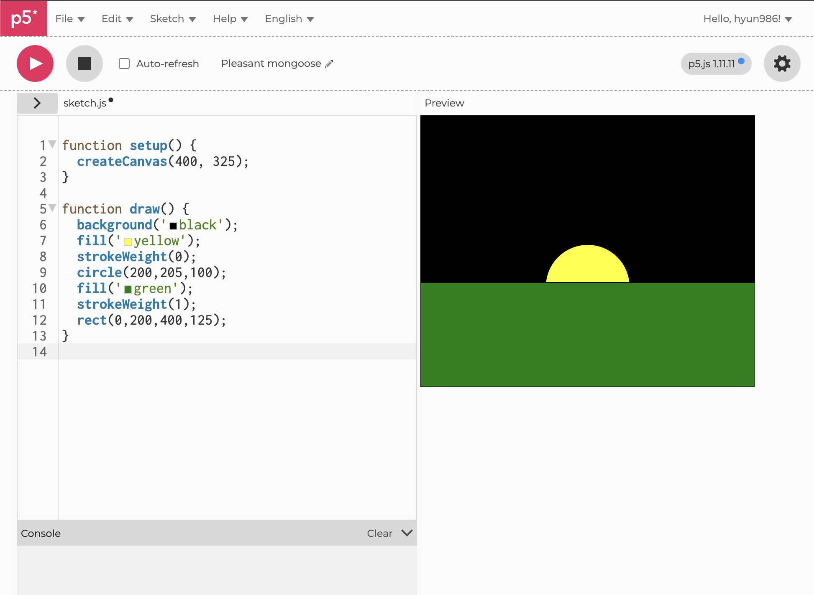
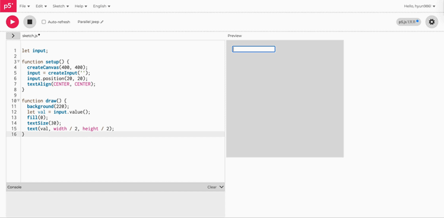
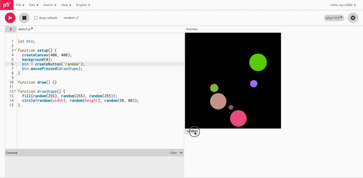

# Experiment 2: Interactivity

[← Back to Home](../index.md)

## In-Class Activities

**Overview:** Using p5.js, explore coding fundamentals and interactive DOM elements (buttons, sliders, text inputs) to create sketches that respond to user input. These activities build on the data drawing concepts from Experiment 1, shifting from physical to digital materials.

---

### Activity 1: Drawing with Code
#### Shapes

*(Screenshots of various sizes and shape experiments)*

#### Warm-up Exercises

<iframe src="https://editor.p5js.org/hyun986/full/apDkOj9WA"></iframe>

*(Screenshots of warm-up experiments)*

In the process of creating forms on a screen through simple numerical inputs, I gained an intuitive understanding of the p5.js canvas coordinate system. I found it particularly engaging during the first task to layer a yellow circle behind a green rectangle to create a visual of a sun setting over the horizon. In the second exercise, I explored the importance of parameter adjustment by using multiple arguments in the rect() function to round corners and precisely aligning the three vertex coordinates for the triangle(). While I initially struggled to estimate the (x, y) positions and had to tweak the numbers repeatedly, it was a valuable experience that helped me develop a sense of how code values translate into visual scale and placement.

### Activity 2: Make an Interactive Sketch

#### Sliders
 
*(GIF of sliders adjusting shape sizes)*

#### Text Input
 
*(GIF of the text input window)*

#### Random Generation Button

*(GIF of the button generating random drawings)*

Beyond simply drawing shapes on a canvas, I learned how users can communicate with the screen in real-time by practising with DOM elements such as createSlider(), createInput(), and createButton(). By observing how a rectangle’s size changed according to the slider’s position and seeing input text appear instantly in the centre of the screen, I intuitively understood how data values connect to visual elements. I was especially fascinated by the exercise where clicking a button triggered the random() function to generate circles in unexpected positions and colours; it showed me that code is not just a fixed output but a 'living system' with infinite possibilities. This was a rewarding session that allowed me to build a solid foundation in interaction design, where user participation becomes an integral part of the work.

### Activity 3: Vibe Code an Interactive Sketch

Dynamic Gravity Field

Organic Tendrils

Spiral Geometric Brush

What I learnt from Activity 3

By utilising an LLM to implement sketches that required complex mathematical logic step-by-step, I was amazed to see how simple snippets of code could transform into organic, life-like movements following the mouse path (Organic Tendrils) or brilliant, geometric spirals (Spiral Geometric Brush).

During my initial attempts, I encountered some trial and error where the particle speeds were too fast or the screen was cluttered with messy trails. However, I managed to resolve these issues by learning how to adjust the alpha value (transparency) of the background to create smooth trails and using lerp and vectors to control acceleration. In particular, mastering the class structure to independently manage the position and velocity of numerous objects was a significant turning point; it helped me realise that coding is not merely a list of commands, but a process of designing a sophisticated physical system.

## Independent Study: Interactive Data Portrait
Overview
Take the data you collected for Experiment 1 and use it as the basis for an interactive p5.js sketch. The challenge is to translate your hand-drawn data portrait into something a viewer can explore, control, or manipulate through interactive elements.

Step 1: Translate your data drawing into code
In this stage, I performed the task of converting the data drawing I collected in Week 1 into p5.js code. Since I had already systematically designed the visualisation rules, I was able to codify them by providing the LLM (Gemini) with specific requirements—such as the 'quarter-fill' logic and the '24-hour coordinate system'—all at once.

Admittedly, there was some trial and error as the LLM did not perfectly grasp my intentions at first; however, I eventually elicited the desired logic by continuously refining and sharpening my prompts. Notably, for parts of the generated code that differed slightly from my actual records, I personally analysed and debugged the code to ensure it aligned perfectly with my original drawing. Through this process, I not only learnt how to efficiently obtain code using an LLM but also developed the ability to read code structures and control them according to my specific vision.

.png>)
.png>)
My original data drawing and visualisation rules from Week 1

Initial data visualisation generated via LLM based on my records

Manual code adjustments and debugging to match the original intent
Final data drawing translated into code and rendered in p5.js

### Step 2: Design your interactive visualisation
In this stage, I used p5.dom to implement an interactive system that allows users to input and visualise their own "spacing out" data. I designed a text input for the time (When), radio buttons for the location (Where), and a dropdown menu to determine the duration (How long). The system is structured so that as soon as the 'Register' button is clicked, a data portrait is drawn onto the canvas in real-time. Once the information is submitted, the values are bundled into an Object and stored in an array; the program then reads this structure to render the visuals instantaneously.

(Screenshot of my "Space-out Recorder" visualisation design)

However, implementing these interactive features led me to reflect on the limitations of the data simplification I had used during the analogue recording stage. When drawing by hand, I limited the locations to just two categories—'Inside' and 'Outside'—due to concerns over visual complexity and legibility. Through this digital transition, I realised that a digital environment allows for 'Details-on-demand'. For example, if I had designed a control method where the data initially appears as a simple circular segment, but reveals specific details (e.g., Library 3rd floor, Park bench) and the exact timestamp only when clicked, I could have achieved both visual clarity and data richness simultaneously.

Step 3: Iterate

To verify that my sketch was functioning correctly, I requested "spacing out" data from a friend. I wanted to improve upon the limitations mentioned in the previous step, so when collecting the data, I asked for more specific details regarding the time, the exact location of where they spaced out, and a more precise duration.

My friend's data: 

07:40 | Spacing out in a room on the bed (30 seconds)

08:10 | Spacing out while eating in the kitchen (10 seconds)

10:15 | Space out in the university classroom (1 minute)

12:40 | Space out in front of the cafe counter (30 seconds)
 

18:20 | Spacing out listening to a song at the bus stop on the way home (1 minute)
 

20:45 | Space out while doing assignments in the room (10 seconds)
 

24:00 | On the Bed, Spacing Out for the Last Time Before Bed (30 Seconds)

Here is the translation into British English. I’ve ensured the tone remains professional and reflective, specifically focusing on your "Details-on-demand" improvement and the technical debugging process.

Iteration and Refinement
I experienced several technical challenges before finalising the visualisation code. A major issue occurred where the fill amount of the circles was supposed to vary based on the duration of "spacing out," yet all data points were incorrectly displayed as "Full" circles. Recognising that AI assistance alone could not resolve this subtle logic error, I researched the necessary mathematical principles and debugged the code line-by-line. Through this process, I gained a deep understanding of the trigonometry involved in drawing circular segments (arc()) and successfully reconfigured UI elements, such as sub-titles, to match my original vision. By testing the completed system with my friend's data, I was able to verify that the program accurately visualises real-world user records.

(Figure. GIF of the improved interactive version)

Furthermore, after discussing the project with my friend, they suggested that while the simple circles were aesthetically pleasing, it would be beneficial if clicking on them revealed more detailed information. I subsequently implemented this "Details-on-demand" feature to further enhance the user experience.

## Reflection
In this experiment, I adopted a 24-hour circular clock structure as the central visual element to answer the question: 'Where do I "space out" the most?' The visualisation rules assigned colours (Inside-Black / Outside-Gold) based on location and used divided areas of the circle (1/4, 2/4, 3/4, 4/4 fill) to represent the duration of each instance. These data points were mapped onto the clock’s coordinates according to the time they occurred. For the interactive p5.js sketch, I built a p5.dom based input system that allows users to select and register the time, location, and length, directly reflecting the rules I developed during the initial design phase of Experiment 1.

The most significant takeaway from this project was the realisation of 'Information Hierarchy', which was impossible to achieve in the analogue work. My hand-drawn portrait was limited by the constraints of a static plane, forcing me to prioritise visual legibility by simplifying location data into just two categories: 'Inside' and 'Outside'. However, transitioning to a digital environment allowed me to overcome these constraints. By utilising the interactive capabilities of p5.js, I maintained a minimalist visual form while introducing a system where specific contexts—such as "spacing out on the bed"—are revealed only when a user clicks a data point. This allowed for a depth of information and layering that a physical drawing could not capture.

Regarding the process, I attempted 'Vibe Coding' by using an LLM (Gemini) to generate the code, but I also encountered its technical limitations. Specifically, there was a mapping error where a 30-second duration (intended to fill half a circle) failed to render correctly, showing a full circle instead. To fix this logic error that the AI could not resolve, I personally analysed the angular calculations of the arc() function and manually debugged the code. This experience taught me that despite the convenience of modern tools, it is vital for a designer to maintain full mastery over the logical structure of their code.

Finally, if given more time to develop this project further, I would like to move beyond simple data registration and add 'Edit' and 'Delete' functions. This would allow users to correct mistakes or remove accidental entries, thereby significantly improving the overall user convenience and functionality of the system.