# Experiment 3: Live Data

[← Back to Home](../index.md)

## In-Class Activities

**Overview:** In this project, I explored the integration of digital and analogue approaches to access, filter, and translate live data into meaningful visual and material forms. Building upon the coding fundamentals established in Experiment 2, I delved into the sculptural possibilities of data by applying rule-based and generative design principles to analogue practices.

---
### Activity 1: Explore with cURL
 

#### Get the weather for a location using its GPS coordinates
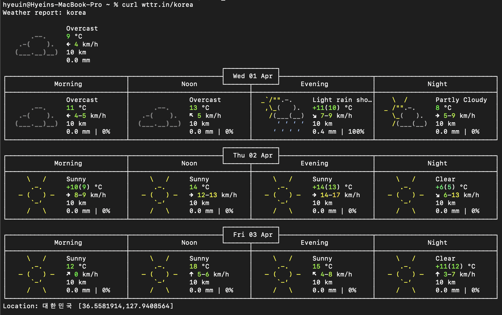
*(Figure 1. Screenshot of terminal application: Weather data for Korea)* [curl wttr.in/Korea]

 

#### Get the weather in a different language
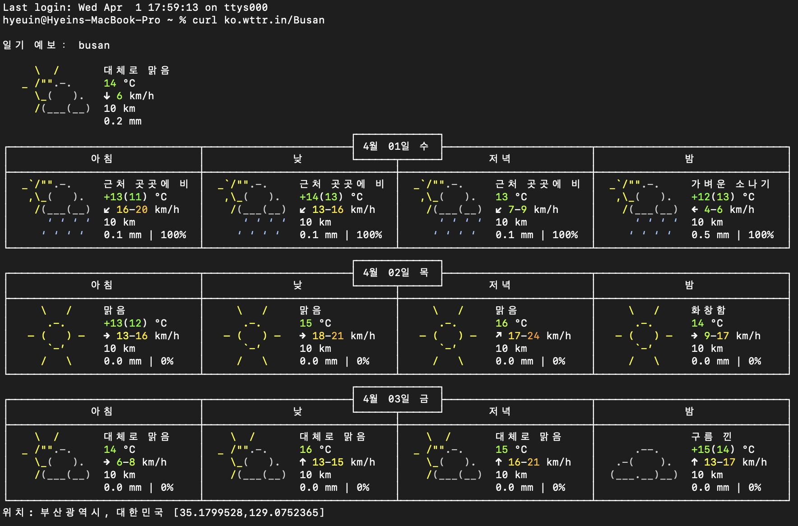
*(Figure 2. Screenshot of terminal application: Weather data for Korea with Korean localized text)* [curl ko.wttr.in/Busan]

 

#### Get the current moon phase
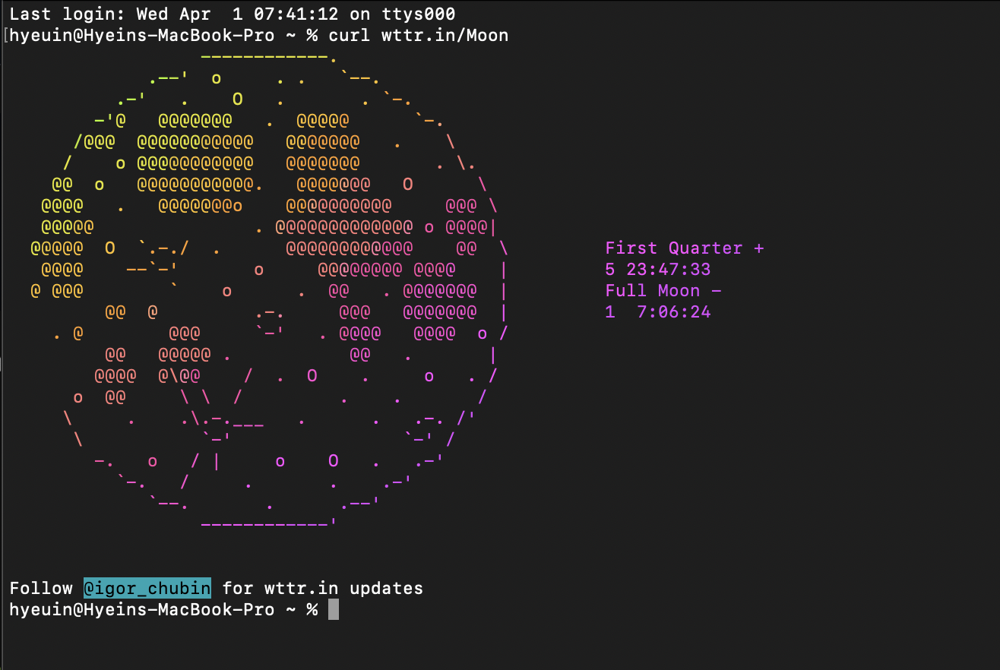
*(Figure 3. Screenshot of terminal application: Current moon phase data)* [curl wttr.in/Moon]

 

#### Look up the synonyms and antonyms of a word: Happy
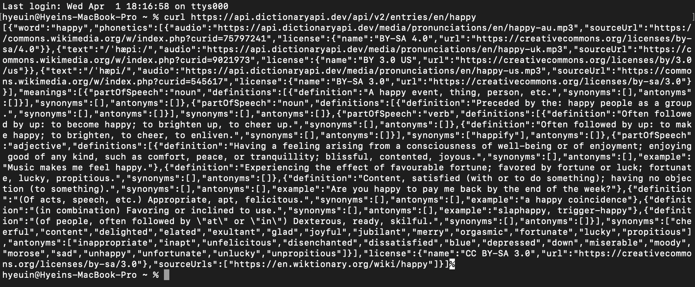
*(Figure 4. Screenshot of terminal application: Dictionary definition of 'Happy')* [curl https://api.dictionaryapi.dev/api/v2/entries/en/happy]

 

#### Find something else in the documentation that we haven’t covered
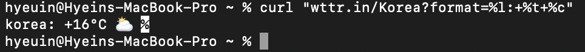 
*(Figure 5. Screenshot of terminal application: Implementation interface)* [curl "wttr.in/Korea?format=%l:+%t+%c"]

 

---
### Activity 2: Weather Visualisation

Using the p5.js web editor, I experimented with mapping real-time weather data for Auckland onto various visual properties. By leveraging the Open-Meteo API, I practised fetching live environmental datasets and translating them into dynamic visual outputs, building on the data-filtering techniques explored in this project.

 

#### Change the latitude and longitude to a different city and observe how the sketch changes
I transitioned the data source from the previous coordinates to Busan (35.17, 129.07) to monitor real-time data shifts. This experiment focused on how localised datasets from contrasting environments differentiate the visual properties, such as colour and shape, within the generative sketch.
 

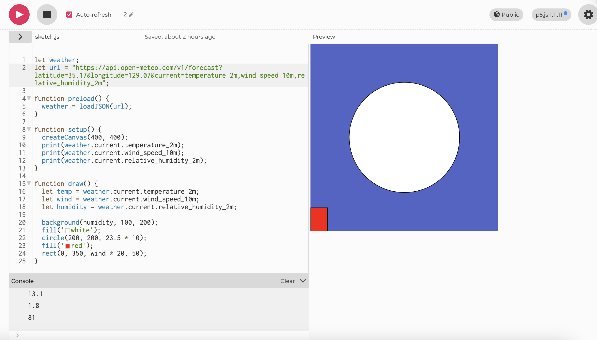
*(Figure 6. Screenshot of p5.js web editor: Updating geographic location)*

 

#### Use the data to control different visual properties: colour, position, size, number of shapes
I experimented with using live data to control various visual properties. Specifically, I modified the sketch to map temperature values to the size of white circles, allowing the real-time thermal data to dictate the physical scale of the visual elements.
 

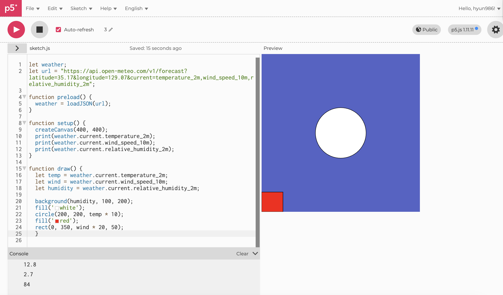
*(Figure 7. Screenshot of p5.js web editor: Visualizing temperature via white circle size)*

 

#### Add more weather variables
I expanded the dataset by adding Cloud Cover from the Open-Meteo documentation. To visualise this variable, I placed a white rectangle in the bottom-left corner and programmed its horizontal width to scale in response to the cloud data. This allowed me to translate atmospheric conditions into dynamic, structural changes within the sketch.
 

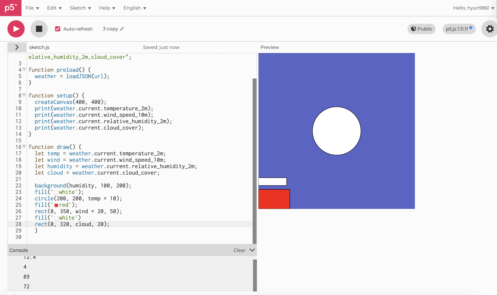
*(Figure 8. Screenshot of p5.js web editor: Integrating cloud cover visualization)*

 

#### Try using random() or noise() alongside or instead of the live data.
Moving beyond simply controlling circle size with temperature data, I integrated wind speed data to govern the circles' movement, creating a more dynamic representation of the environment. To enhance the focus of the visualisation, I removed the redundant red rectangle at the bottom and replaced it with a data bar dedicated to cloud cover. This structural change enabled a cleaner composition, prioritising the relationships among multiple weather variables through more refined visual mapping.
 

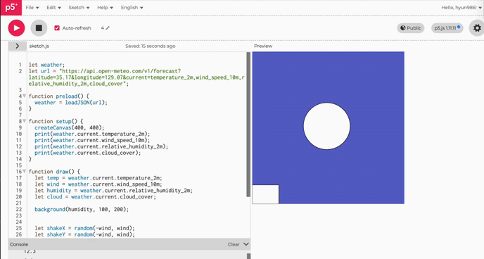
*(Figure 9. GIF of p5.js web editor: Generative motion using random and noise functions)*

 

#### Use vibe coding to try something more ambitious

In this experiment, I moved beyond fragmented data points by using vibe coding to synthesise separate weather variables into a single, cohesive, and highly readable visual experience. My goal was to allow users to instantly feel the city's current weather through a singular, dynamic object.

- Temperature = Circle colour:
I mapped temperature data to the circle's colour using the lerpColor function. The colour transitions smoothly from cool tones (Blue) for low temperatures to neutral tones (Yellow/Green) and warm tones (Red) for high temperatures. This allows users to intuitively grasp the "feel" of the temperature through colour alone.

- Wind Speed = Movement (Kinetic Energy):
Wind speed data was utilised to define the range of the random() function. As the wind strengthens, the circle shakes more dynamically, breathing the "energy" of the weather into a static screen. If there is no wind, the circle remains perfectly still.

- Humidity = Background (Atmospheric Depth):
Humidity levels influence the saturation and brightness of the background. By increasing the depth of the blue tones as humidity rises, I recreated the atmospheric feel of air saturated with water vapour.

Conclusion: Instead of listing multiple shapes, I concentrated the temperature, wind speed, and humidity data into a single circular object. This approach successfully visualises the dynamic nature of weather in a way that is both minimalist and intuitively impactful.

 

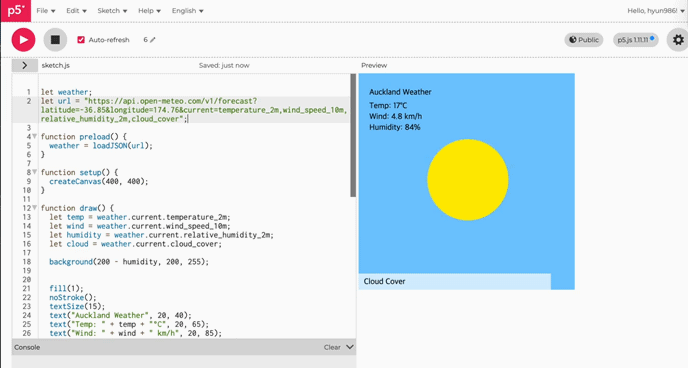
*(Figure 10. GIF of p5.js web editor: Real-time weather visualization for Busan)*

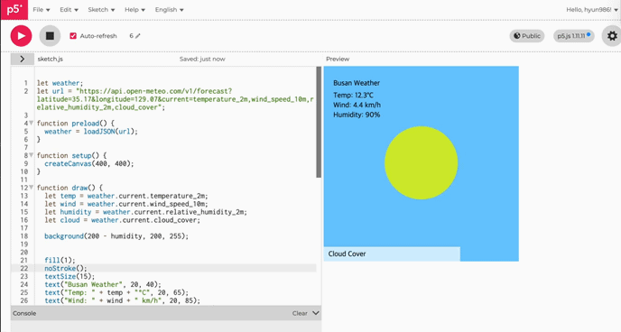 
*(Figure 11. GIF of p5.js web editor: Real-time weather visualization for Auckland)*

 

--- 

### Activity 3: Design and Execute a Data Protocol

 

#### Our Protocol: Mapping the Physical Presence of Digital Engagement

We designed a protocol to observe how digital device usage manifests physically within a shared space, turning invisible connections into visible markers.

- **Source:** The number of people actively using a mobile phone in the room.

- **Frequency:** Every 30 seconds

- **Mapping:** Each observation is recorded as a pictogram: a stick figure holding a phone. One figure equals one person actively engaged with a device

- **Intent:** To visualise the digital footprint within a physical room, showing how many individuals are physically present but digitally occupied at specific moments

 

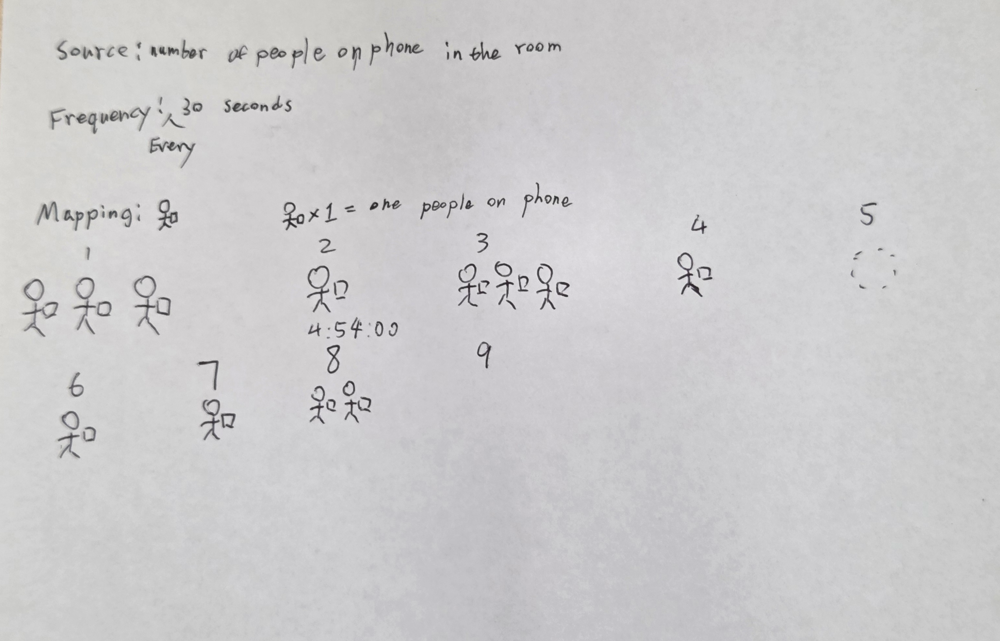
*(Figure 12. Documentation: Our team's design protocol)*

 

### Other Team's Protocol: Mapping Table Language Diversity

- **Source:** Track your table member first language they speak update every time the member changes (includes add or decrease)

- **Frequency:** Event-driven; update the data every time the member count changes (whenever a person joins or leaves the table)

- **Mapping:** Visualise the distribution of different languages as a Pie Chart, where each slice represents the proportion of a specific language spoken by the group

 

 
*(Figure 13. Documentation: Comparison with other team's protocol)*

\
Overall, the rules were interpreted relatively clearly as intended. Specifically, when numerical data like the number of people and clear visualisation methods like pie charts were provided, the executor could record the data without major errors. However, some ambiguous criteria existed during the recording process. For instance, it was unclear which situations should be counted when people joined or left—whether to include only those sitting at the desk or those standing nearby and interacting with the group. Additionally, the criteria for determining the primary language were vague; it needed a definition of whether to base it on a person’s mother tongue or the language they use most in daily conversation. A particularly interesting result was that the backgrounds of the members, which previously existed only as numbers, became instantly recognisable through the pie chart. This demonstrated how effective data visualisation is in conveying information intuitively. Furthermore, because it was a small group, the chart proportions shifted significantly with each person adding or leaving. This led to the realisation that a single individual has a surprisingly large impact on the identity of the entire group.

 

## Independent Study: Live Data Visualisation

**Overview:** In this Independent Study, I chose a digital visualization approach (Option A) to build a p5.js sketch that reinterprets ever-changing live data from an external API in real-time.

--- 
 

### Step 1: Data Acquisition & API Integration

API Options I Considered:
- CoinGecko API (https://www.coingecko.com/en/api)
- OpenWeatherMap (https://openweathermap.org/api)
- WAQI API (https://aqicn.org/data-platform/token/)
- Sunrise Sunset (https://sunrise-sunset.org/api)
- REST Countries (https://restcountries.com/)

\
Among the above data options, I selected the World Air Quality Index (WAQI) as my final data source to address the urgent environmental challenges of modern society. Since air quality is invisible yet has a profound impact on our lives, I aim to translate abstract fine dust data into an intuitive visual language. This sketch is designed to help anyone perceive atmospheric conditions instantly and raise awareness about the seriousness of environmental pollution.

 

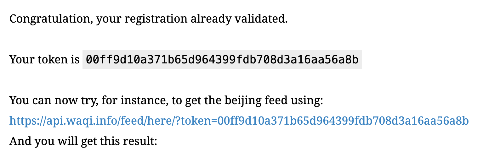
*(Figure 14. Screenshot of WAQI web page)*

(Figure 9. GIF of p5.js web editor: Generative motion using random and noise functions)

I signed up for the WAQI website and got my own API key. This lets me get real-time weather and air data for my project.

 

---
 

### Step 2: Collaborative Development & Refinement with Gemini
*Using LLM as a strategic partner to turn abstract ideas into a precise p5.js algorithm.*

To transform my initial concepts into a functional algorithm, I used Gemini as a strategic development partner rather than just a code generator to turn my ideas into a working project. My goal was to move beyond simple coding and focus on how to technically express abstract feelings like "air texture" and "visual instability" caused by fine dust. By brainstorming with Gemini, I chose the best p5.js functions like lerpColor, noise, and map to match my vision. I also used a feedback loop to fix details; for example, I adjusted the particle speed and background colours when they didn't feel "heavy" or "polluted" enough. This refining process helped me match the visual rhythm on the screen with the one in my head. In the end, this co-creation experience helped me overcome technical limits and let me put my artistic style directly into the algorithm.

 

---
 

### Step 3: Final Generative Visualization
*The completed interactive sketch that visualizes real-time air quality*

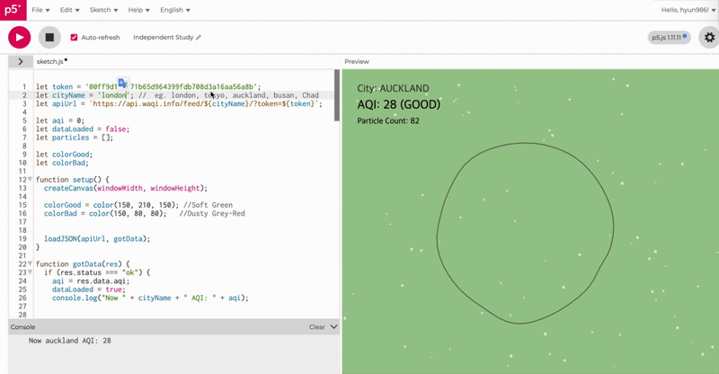
*(Figure 15. GIF of p5.js web editor: Final Generative Visualization)*

 

To ensure the visualisation works correctly across different environments, I tested the sketch with real-time data from various countries. I conducted a comparative analysis by inputting data from Auckland, known for its clean air, and Chad, which often records the highest levels of fine dust globally.  The results confirmed that the algorithm responds accurately to the data: the visual transition between clean and polluted air was clear and impactful. 

 **Mapping Strategy:** The core objective of this project was to translate the abstract data of the Air Quality Index (AQI) into an intuitive Visual Language. Beyond simply delivering information, I designed a specific mapping strategy to ensure that data fluctuations directly impact the user’s sensory perception:

 

**Background: Visualising Overall Atmospheric Density**
- Mapping Logic: When the air is clean, the background maintains a vibrant, light green. As pollution levels rise, the colour function triggers a gradual transition toward a murky, greyish-red (dark and dull).
- Design Intent: By manipulating saturation and brightness, I intended for users to instinctively perceive the current pollution level the moment they face the screen.

 

**Central Shape: Indicators of Air Quality and Stability**
- Mapping Logic: At low AQI levels, the central shape remains a perfect, smooth circle, representing a state of tranquillity. However, as the index increases, the noise function intervenes, causing the form to distort and warp grotesquely.
- Design Intent: The breakdown of a structured form is a visual metaphor for the psychological anxiety and physical discomfort triggered by a contaminated environment.

 

**Particles: Visualising Airflow and Smog**
- Mapping Logic: On clear days, light air is depicted by a few particles moving quickly and vividly. Conversely, as pollution worsens, I amplified the particle count while making their movement slower and blurred (using low Alpha values).
- Design Intent: Through the contrast in particle density and speed, I aimed to recreate the suffocating experience of smog and visualize the physical pressure caused by atmospheric stagnation.

 

### Reinterpreting Real-time AQI through Visual Rhythm:
This project utilises an external API to retrieve real-time Air Quality Index (AQI) data, which serves as the visual heartbeat of the sketch. Each time a user refreshes or triggers a new data request, the sketch reinterprets the current atmospheric conditions into a unique sensory experience. While numerical AQI data can feel abstract and difficult to grasp, this visualisation transforms that data into an intuitive format that anyone can understand at a glance. When the AQI is low, the screen displays clear colours, subtle deformations of the central circle, and a sparse number of particles, creating a calm and stable rhythm that symbolises clean air. Conversely, as the index rises, the background turns murky, particle density increases sharply, and the central form begins to oscillate violently. By translating the invisible severity of pollution into a visual language of dynamic tension and heavy tones, I intended for users to feel environmental changes viscerally—something that mere abstract numbers cannot convey. Ultimately, by aligning the rhythm of the data with the visual rhythm of the sketch, this project bypasses the need for complex data interpretation. Instead, it allows users to instantly sense the gravity of the current air quality through visual movement and weight.

 

---
 

## Reflection

### Did you take a digital or analogue/physical approach? Why?
I chose a digital approach for this project. Air Quality Index (AQI) data is inherently fluid and changes constantly in real-time. To best express this immediate flow and the dynamic nature of the data, I determined that a motion-based visualisation using p5.js code was the most appropriate medium. Furthermore, I adopted this digital method to portray the atmospheric state as a "living organism" through subtle changes in colour and the organic movement of particles.

 

### What live data source did you work with, and how did you access it? 
 I utilised the public API provided by the WAQI project. This service offers real-time air quality data from cities worldwide, which allowed me to call specific AQI values in JSON format. By using the loadJSON() function in p5.js, I implemented a system that directly fetches live data from the web and integrates it into my sketch.

 

### How did you decide on the mapping between data and visual/material form? 
 My primary focus was on visceral perception, ensuring that the visual representation allows users to instantly grasp the air quality levels. Since the background covers the largest area, I used its brightness and saturation to signal the clarity or murkiness of the atmosphere. The central shape—a perfect circle—is designed to distort and warp according to pollution levels, symbolising the psychological anxiety and environmental degradation caused by poor air quality. Finally, I mapped the density and speed of particles to the concentration of fine dust. This recreates the phenomenon of smog, where the visual flow becomes congested and stagnant as the air gets heavier.

 

### What does your work reveal or communicate about the data? 
 My work communicates the materialisation of abstract numbers. While people often feel indifferent to a simple statistic like AQI 150, my project transforms this threat into a visual warning through violently oscillating forms and murky, reddish tones. Through this process, the work allows users to instinctively feel the atmospheric pressure and the unseen threat of air pollution that surrounds our daily lives.

 

### Did you use vibe coding, LLMs, or other tools in your process? What did you learn? 
 In the process of implementing the p5.js code, I utilised LLMs such as Gemini as a supportive tool. These tools provided logical assistance, particularly when controlling the complex noise() function or mapping API data to the particle system. Through this collaboration, I learned that coding is not merely about inputting commands but is a process of translating my artistic intent into algorithms. This approach allowed me to focus more deeply on the realisation of my ideas rather than being hindered by technical limitations.

 

### How does your work relate to the practitioner examples discussed in class? 
 My work is closely related to the methodology of David Bowen, a renowned media artist who visualises invisible natural forces and real-time data through physical devices and robotic technology. For example, his piece Tele-Present Water collects real-time wave data from a remote ocean and mimics that movement through a grid structure, physically manifesting nature’s dynamism for the viewer. Inspired by Bowen’s philosophy of materialising the invisible, I focused on giving physical presence to data. Just as Bowen translated wave movements into mechanical rhythms, I reinterpreted invisible AQI data into a visual rhythm defined by particle density and geometric distortion. Ultimately, by building a data-driven system where external variables dictate form and motion, my project serves as a digital-age continuation and practice of Bowen’s artistic approach.

 

### What would you develop further with more time? 
 If given more time, I would like to integrate additional data sources such as wind speed and direction alongside the AQI values. While the particles currently only change in number and transparency, mapping them to actual wind data would allow me to control their direction and velocity across the screen. For instance, on a day with high pollution but strong winds, I could visualise the particles being swept away rapidly in a specific direction to create a more three-dimensional representation of atmospheric flow. Additionally, I hope to expand this into a synesthetic experience by incorporating sound interactions that become more dissonant as air quality worsens. This project taught me that data visualisation is not just about creating beautiful images, but about discovering the emotions and messages hidden within data. My greatest takeaway was realising that when technology and art combine, simple statistics can become a powerful tool for shifting human perception.