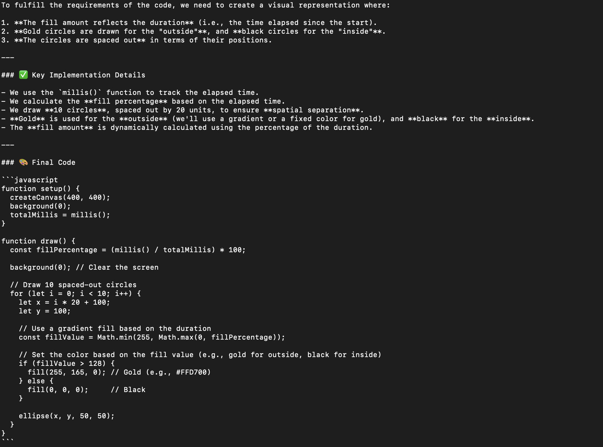
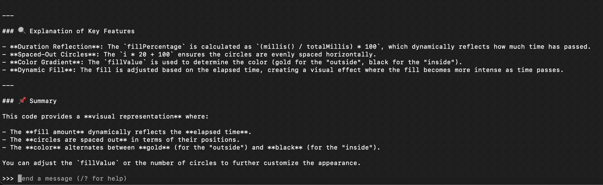
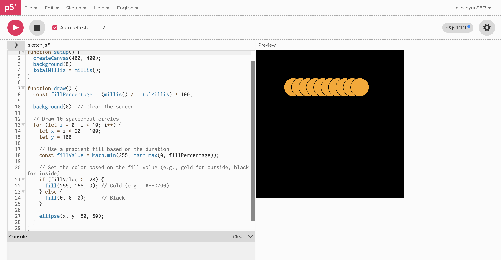
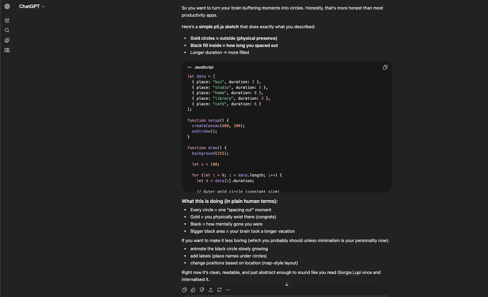
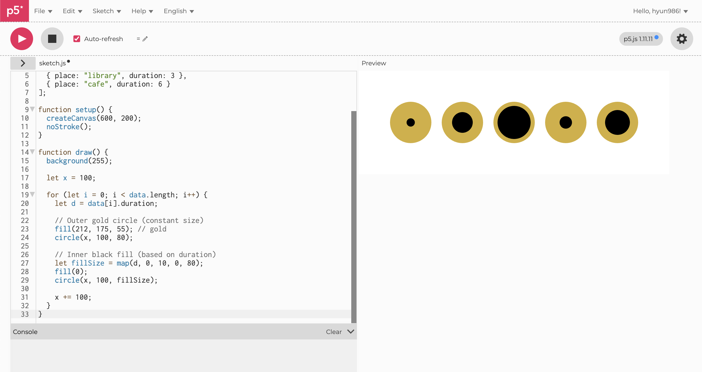
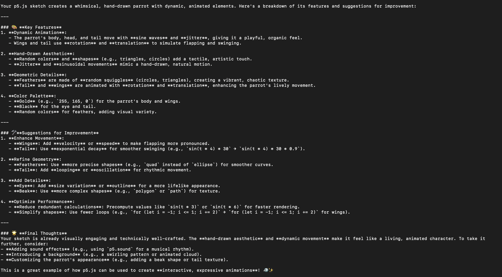
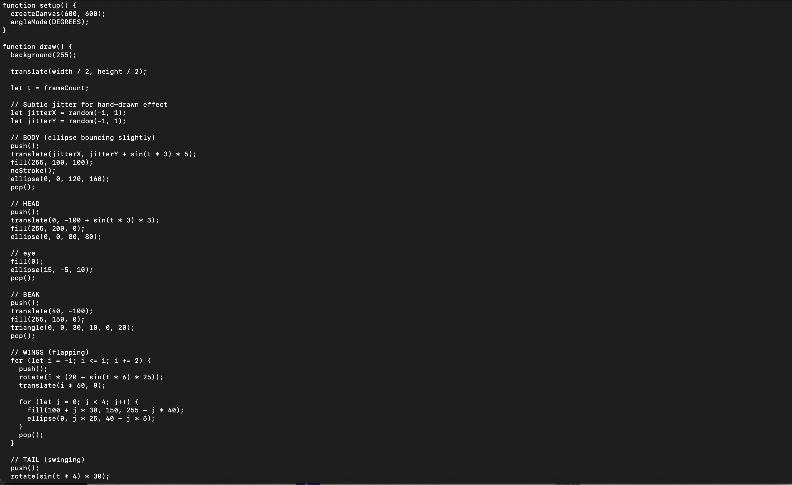

# Experiment 4: Artificial Intelligence

[← Back to Home](../index.md)

## In-Class Activities

**Overview:** In this experiment, I explored both local and cloud-based AI workflows. These activities allowed me to engage with the practical and ethical dimensions of working with AI, building on the concepts of data representation I studied in previous experiments.

---
### Activity 1: Local AI with Ollama
For the first activity, I used Ollama to run a local AI model and tested its ability to generate creative code.
 
 

**[TEST 1]** Prompt: Write a simple p5.js sketch representing 'spacing out' moments using Gold circles for outside and Black for inside, where the fill amount reflects the duration.

**Ollama**

*(Figure 1,2. Screenshot of Ollama page)*

 
*(Figure 3. Screenshot of p5.js web editor: Ollama prompt)*

 

**ChatGPT**

*(Figure 4. Screenshot of ChatGPT page)*

 
*(Figure 5. Screenshot of p5.js web editor: ChatGPT prompt)*

 

**[TEST 2]** Prompt: A whimsical p5.js sketch of a brightly colored parrot with feathers made of colorful shapes. The parrot is dancing to an invisible rhythm, its wings fluttering and tail feathers swinging back and forth with exaggerated, joyful movements. Simple geometric shapes like circles, triangles, and squiggles form the feathers and body, animated with a playful, hand-drawn aesthetic against a stark white background.

**Ollama**

 
*(Figure 6,7. Screenshot of Ollama page: Parrot)*

*(Figure 8. GIF of p5.js web editor: Ollama prompt)*

 

**ChatGPT**

*(Figure 9. Screenshot of ChatGPT page: Parrot)*

*(Figure 10. GIF of p5.js web editor: ChatGPT prompt)*

 

#### Analysis: Comparison of Model Performance

During this stage, I spent about 10 minutes exploring Ollama, a local LLM tool, and conducted two main experiments. First, I asked the AI to interpret my 'spacing out' data from Experiment 1 and suggest visualization ideas. Second, I instructed it to generate a p5.js sketch of a 'dancing parrot.' To evaluate the performance, I entered the exact same prompts into ChatGPT to compare the two models.

**1. Speed**\
Ollama felt significantly slower than the cloud-based ChatGPT, likely because it was running locally on my machine. In a workflow where ideas need to be exchanged in real-time, Ollama's response time was somewhat frustrating.

**2. Understanding and Quality**\
Despite using identical prompts, there was a noticeable gap in how each model understood my intent. Ollama struggled to grasp the instructions at first, requiring several follow-up prompts to get it on the right track. In contrast, ChatGPT delivered a fairly complete version of the parrot’s form and movement with just a single prompt.

**3. Overall Satisfaction**\
Even after multiple revisions with Ollama, the final sketch did not meet my expectations. ChatGPT was far superior in terms of visual detail and code accuracy.

**Conclusion**\
Through this comparison, I clearly felt that Ollama currently falls short of ChatGPT in both speed and quality. For tasks involving complex visualization logic or artistic sketching, it is essential for a model to capture the user's intent quickly and accurately. Ollama showed limitations in this "capability." Consequently, I concluded that high-performance models like ChatGPT are still much more advantageous for an efficient creative process.

 

---

### Activity 2: Cloud AI with NotebookLM
For the second activity, I used NotebookLM to organize my research and experimentation. I created a new notebook and integrated various sources to build a personalized knowledge base.

 

#### 1. Building the Notebook

I curated a collection of resources that have shaped my understanding of data and AI. The sources included in my notebook are as follows:

My Making Journal: https://hyun986-spec.github.io/hyun986-making-journal/\
Practitioner Inspiration (David Bowen): https://www.dwbowen.com/\
Data Sources (World Bank Fertility Rates): https://data.worldbank.org/indicator/SP.DYN.TFRT.IN\
Creative Resources (The Coding Train): https://thecodingtrain.com/\
Giorgia Lupi’s Talk on Data Humanism: https://www.youtube.com/watch?v=sFIDCtRX_-o\
Māori Feminism Context: https://www.youtube.com/watch?v=VXy8S3kvnlE

 

#### 2. Framing the Research (context.md)

To guide the AI's focus, I created a context.md file. This document outlines my core interests and directs the AI toward my specific research goals.
Content of context.md:\
The experiment I found most interesting, and why:
Experiment 3, which focused on data exploration through APIs, was the most engaging activity for me. It was truly impressive to move beyond passively receiving datasets and instead directly extract and control real-time data to create a custom sketch. By designing a system that aligned with my specific vision and communicating with LLMs to evolve the data flow, I was able to transform raw numbers into a dynamic visual design that communicates information at a glance.

A theme or idea I keep coming back to:
The concept of "Data Humanism," which originated from my "Spacing Out" records in Experiment 1, has been a constant theme in my creative process. I am continuously exploring ways to translate cold, rigid numbers into warm, meaningful narratives about small, unconscious human moments. I am deeply fascinated by the idea that data visualization can transcend being a mere information tool and become an artistic medium that fosters empathy for the human experience.

Something I’m curious about but haven’t had a chance to explore yet:
I have long held a deep interest in global low birth rates and the resulting demographic imbalances, but I have not yet had the opportunity to explore this topic in depth. I am curious to identify which countries are facing the most severe "population cliffs" and how the underlying social and economic drivers are reflected in data. In particular, I want to see what new insights can be gained by reinterpreting macro-level social data through the lens of "Data Humanism"—shifting the focus from raw statistics to the micro-level lived experiences of individual women and families.

 

 
*(Figure 11. Screenshot of the NotebookLM page showing the uploaded sources and context.md)*

 

---

### 3. Explore in the Chat
After setting up the notebook, I interacted with the AI using specific prompts to analyze my sources and research direction. Below are the prompts I used and my reflections on the AI's responses.

 

**Prompt 1: Identifying the Value of My Work**
- "Based on my making journal and the sources I provided, what are the core values or themes that I seem to care about as a designer?"

*(Figure 12. Screenshot of the NotebookLM 1)*

Reflection: The AI successfully connected my fragmented experiments into a coherent identity, using keywords like Data Humanism and Active Designer. It was encouraging to see the AI objectify my work and discover its social value. However, I felt that some of the simple joy and specific technical struggles I experienced were overshadowed by grand academic terms like "Ethical Sovereignty." While the AI helped define my professional identity, it left me thinking about how to balance this high-level framing with my own concrete, personal experiences.

 

**Prompt 2: Imagining the Final Project Outcome**
- "If all these sources—David Bowen's kinetic art, the World Bank's low birth rate data, and Giorgia Lupi's 'Data Humanism'—were documentation for a single design project, what would the final outcome look like?"

*(Figure 13. Screenshot of the NotebookLM 2)*

Reflection: I was impressed by the AI's creativity in integrating three very different sources—David Bowen’s mechanical aesthetics, World Bank statistics, and Giorgia Lupi’s philosophy—into a concrete solution: "A kinetic installation powered by real-time data." However, the AI included my "spacing out" records in its response based on previous context, even though I had intentionally excluded them from this specific prompt. This highlighted a limitation: AI tends to arbitrarily fill in gaps based on past data. I realized that a designer’s "critical editing ability"—the power to filter out unnecessary elements and focus on the core (e.g., the artistic reinterpretation of low birth rate data)—is essential.

 

**Prompt 3: Identifying a Provocation or Challenging Question**
- "Identify a 'provocation' or a challenging question hidden in my sources regarding how we treat human data vs. macro-level statistics."

*(Figure 14. Screenshot of the NotebookLM 3)*

Reflection: The AI provided a sharp insight, challenging my bias that data is always an "absolute truth." It suggested that to capture "uncountable human moments" that numbers miss, one must sometimes look past the numbers themselves. A major takeaway was the idea of designing data that captures human aspiration rather than just proving a deficiency. On the downside, these insights were quite philosophical, offering no clear methodology on how to actually implement "imperfection" as a numerical value in a design. The challenge of maintaining objectivity while fostering empathy remains a task for me to solve.

 

**Prompt 4: Verifying Source Usage**
- "Which specific parts of my sources did you use to come up with that answer, and were there any sources you ignored? Why?"

*(Figure 15,16. Screenshot of the NotebookLM 4)*

Reflection: A strength of the AI was its ability to accurately link the emotional reflections in my journal with Giorgia Lupi’s philosophical background to build a "design narrative." However, by ignoring "administrative" data like menus or help guides, the AI glossed over the specific technical contexts and limitations of the actual implementation. I noticed a potential for data distortion: because the AI selected sources to fit the specific philosophical frame of "Data Humanism," my work felt overly romanticized or biased toward that interpretation. This was a crucial moment for me to critically view how AI selectively accepts information and potentially shifts the original intent.

 

---

### 4. Generate the Audio Overview
After exploring the chat, I generated the Audio Overview in NotebookLM. I listened to the AI-generated conversation between two hosts discussing my research and sources.

*(Figure 17. Screenshot of the NotebookLM: Audio)*

**1. What surprised you the most?**\
What surprised me most was the AI's ability to perfectly grasp the context of my English assignment files and website links and generate a natural conversation in Korean, my native language. I was deeply impressed by its storytelling ability, turning my project into an engaging 15-minute podcast that never felt boring. I could truly feel the power of the AI's analytical skills as it organically connected my work with the "macro-narratives" I specifically asked about, such as Giorgia Lupi’s theories and Māori Data Sovereignty.

**2. What did it get wrong?**\
I did not find any significant errors or downsides. Since I intentionally requested a detailed explanation of the theoretical backgrounds, such as Giorgia Lupi, the AI focused on those areas, which successfully strengthened the philosophical roots of my project. While I had hoped to hear a bit more detail regarding my specific individual experiments during the 15-minute runtime, they were only mentioned briefly. However, I am satisfied because this was the result of the AI accurately reflecting my specific prompts, allowing me to more clearly understand the social and ethical value of my work.

**3. How does hearing your work discussed feel different from reading the chat responses?**\
While reading chat responses felt like simply retrieving information to answer my questions, the audio provided a multidimensional experience where a third party told a story based on my interests. Listening to complex theories—which were sometimes difficult to grasp via text—explained through a conversational dialogue made them much easier to understand and absorb quickly. This "auditory narrative" not only prevented boredom but also gave me the feeling that the information was sticking in my mind much more effectively.

 
 

## Independent Study: AI-Assisted Data Exploration
**Overview:** For this week’s independent study, I chose to explore a public dataset focused on life in Aotearoa New Zealand. 

---

### Step 1: Find a Dataset
**Dataset Title:** The attributes of high achieving secondary school students and their teachers\
**Source:** https://catalogue.data.govt.nz/dataset/oai-figshare-com-article-5466595

For this week’s independent study, I selected a qualitative dataset containing survey responses from 583 secondary school students across Aotearoa New Zealand, collected in 2016. This dataset includes students’ perceptions of what defines an "academically successful student" and their descriptions of both the "best" and "worst" teachers they have encountered.

The reasons behind my selection of this dataset are deeply rooted in my personal background. As someone who completed the New Zealand secondary education system just a few years ago, I have always been fascinated by the practical dynamics between high achieving students and the teachers who drive their growth. What makes this data particularly special to me is that it refuses to be confined to mere academic scores. Instead, it captures vivid, qualitative records of how students subjectively define success and the real-life interactions that enrich their learning experiences.

*(Figure 18. Screenshot of the Dataset: The attributes of high achieving secondary school students and their teachers)*

--- 

### Step 2: Understand the Data
To gain a comprehensive understanding of the dataset, I uploaded the CSV file to Gemini and NotebookLM. Rather than simply relying on the default outputs, I engaged in a sustained dialogue with these tools in Korean to refine the information and critically evaluate the data from my own perspective as a designer. It is important to note that the following analysis is not a raw AI output; it is a result that I have personally critiqued, challenged, and refined. Throughout the process, I pointed out logical inconsistencies in the initial AI suggestions and added necessary context to ensure the final insights truly reflect the depth of the students' voices.

**1. What stories might this data contain?**\
This dataset is far more than a collection of educational statistics; it contains narratives of relationship and growth within the New Zealand secondary school system in 2016. Behind the NCEA grades, I discovered the personal values of students who believe that "success is not just a score, but doing one's absolute best." It reveals the psychological journey of adolescents who open their hearts only when they feel respected as individuals. The stories are both heartwarming and poignant—students describe their best teachers as "friends or mentors," while remembering their worst teachers as those who "ignored or looked down on them." It suggests that education is ultimately about human-to-human connection, not just the transfer of knowledge.

**2. What questions could it answer?**\
The data provides clues to fundamental questions such as: "How do high-achieving students define 'good education'?" It also offers insights into complex correlations, such as how a student’s ethnic background or parental education level relates to their Expected Qualification. Furthermore, I noticed intriguing patterns regarding Māori identity (Iwi) and how its recognition provides a sense of psychological security and academic motivation. Ultimately, it helps answer: "What human values should the classroom of the future uphold?"—highlighting that students often value empathy and passion over mere technical expertise.

**3. What biases or gaps are present?**\
Upon critical review, a significant gap in the form of "information inequality" became apparent. While students at the beginning of the dataset provided detailed descriptions of their thoughts, many qualitative responses towards the end (around S-520 onwards) were left blank or replaced with "I don't know." This "thinning" of data might indicate survey fatigue or the marginalisation of certain groups, risking a bias towards the voices of those who "are able to speak." Additionally, there is a clear self-reporting bias, as the data relies entirely on subjective perceptions rather than objective facts. I also noted a higher proportion of female respondents, which may limit a balanced gender perspective.

**4. Who collected this data, and for what purpose?**\
Registered on the New Zealand public data catalogue (catalogue.data.govt.nz), this data appears to have been collected by educational authorities or research institutions to analyse the characteristics of high achievers and the qualities of influential teachers. The inclusion of ethnicity and family background suggests a humanistic intent: to move beyond standardising students as mere figures and instead understand how unique backgrounds and emotional experiences contribute to educational outcomes. It reflects a policy-driven goal to design a more inclusive, student-centred curriculum for Aotearoa.

**5. Reflection on AI Tool Performance: Gemini vs. NotebookLM**\
In conclusion, my experience showed that NotebookLM provided more detailed and grounded information compared to Gemini. While Gemini was excellent at capturing the desired "tone" in a single prompt, it frequently hallucinated or invented details, requiring me to intervene and correct the information constantly. On the other hand, NotebookLM stayed strictly within the bounds of my selected data; although it required more effort to get the exact answer I wanted, it was far more reliable and produced fewer errors. By engaging in active dialogue and challenging both models, I was able to synthesise a consistent and high-quality final explanation.

--- 

### Step 3: Design Multiple Representations
In this stage, I aimed to transform the qualitative insights into visual forms. Adhering to the principle of not simply accepting the first AI-generated output, I established a rigorous visual guideline and tested multiple iterations. To manage resources efficiently and achieve high-fidelity results, I refined my prompts through several stages of "Design Thinking."

 

**1. Overall Summary Infographic (Overview)**\
This representation is useful for showing the core contents of the data at a single glance.
- Prompt: Create an infographic summarising New Zealand secondary school students' perceptions of 'academic success' and 'teacher quality' in 2016. Visually represent the gender and ethnic distribution of students, the five most important traits mentioned for academic achievement, and the key differences that distinguish the best teachers from the worst.
.png>)
*(Figure 19. Screenshot of the "Overview" infographic prompt and AI response in the NotebookLM chat)*

 

**2. 'Successful Student' Profile Analysis (Student Success Profile)**\
This approach focuses specifically on the factors that students identify as drivers of success.
- Prompt: Based on the source data, produce an infographic titled 'Portrait of an Academically Successful Student'. Use charts and icons to show the character traits commonly mentioned by students (e.g., diligence, organisation, resilience), their learning habits.
.png>)
*(Figure 20. Screenshot of the "Student Success Profile" conceptualisation within NotebookLM)*

 

**3. 'Best vs Worst' Teacher Attribute Comparison (Best vs Worst Teacher)**\
This version contrasts student perceptions to derive critical educational insights.
- Prompt: Create an infographic comparing student perceptions of the best and worst teachers. Visualise the positive attributes held by the best teachers (passion, empathy, individual support) and contrast them with the negative attributes of those cited as the worst (unkindness, unclear explanations, favouritism) using a contrasting layout.
.png>)
*(Figure 21. Screenshot of the comparative analysis between "Best" and "Worst" teachers in NotebookLM)*

 

**4. Demographics and Background Centred (Demographics & Background)**\
This representation is ideal for exploring the relationship between parental education levels and student achievement.
- Prompt: Generate an infographic analysing the demographic backgrounds of the 583 students in the survey. Organise the ethnic distribution, parents' education levels, and their NCEA achievement levels into a layout that can be understood at a glance.
.png>)
*(Figure 22. Screenshot of the final consolidated "Master Dashboard" prompt and the structured data synthesis in NotebookLM)*

#### Final Synthesis: Consolidating into a Master Dashboard
After testing the individual versions above, I designed a final master prompt to integrate all elements into a single, high-density dashboard.
- Final prompt: Create a comprehensive dashboard infographic for 2016 NZ secondary students. Top Section (Context): Summary charts of the 583 participants (gender, ethnicity, parental education). Centre Section (The Student): A 'Profile of Success' featuring key keywords like diligence and resilience. Bottom Section (The Teachers): A contrasting comparison of qualities between the 'Best' and 'Worst' teachers. Style: High-density 'Data Humanism' approach, prioritising qualitative student narratives over standard statistical graphs.
.png>)
*(Figure 24. Screenshot of the final "Master Dashboard" synthesis in NotebookLM)*

 

---

### Step 4: Critically Evaluate
**What was the AI’s default approach?**\
In the visualisation design process, I made a conscious decision to break away from the AI’s inherent 'efficiency-orientated' assumptions. Because generating images required limited credits, I had to be meticulously prepared to ensure the AI did not fall into the trap of treating the data as merely 'objective statistics'—confining it to cold, blue bar charts or rigid rectangular boxes.

**What did you have to override or correct?**\
I provided detailed visual guidelines to generate four distinct versions. Although they shared the same data, each focused on different core elements. I then took charge of the structural design, instructing the AI to integrate these into a single, organically connected "Comprehensive Dashboard." Crucially, I redirected the AI to place subjective student responses (such as diligence and communication)—which AI often de-prioritises—at the central focus of the visualisation. This ensured that the 'student', rather than the 'number', remained the protagonist of the data.

**Which representation was the most interesting, and why?**\
The final consolidated dashboard, which integrated the four perspectives (background, student, teacher, and statistics), was the most compelling. Data points that initially seemed fragmented were woven into a complete narrative: 'Student’s Environment → Student’s Values → Teacher’s Influence.' It was fascinating to see the AI’s output align with the 'organic connectivity' I had envisioned.

**What would you have done differently without AI?**\
If I had brainstormed and drawn this by hand, I would have moved away from representing the average data of 583 students. Instead, I would have created a 'Data Portrait' focusing on a single student who left the most poignant response. While AI excels at processing all elements simultaneously, I would have focused more on individual uniqueness to complete the task efficiently. I also would have eschewed the AI’s polished layout in favour of imperfect lines and hand-drawn typography to better capture the raw emotions of the students.

 

## Reflection

**Dataset Selection and Rationale**\
I selected a 2016 survey dataset titled ‘The attributes of high achieving secondary school students and their teachers’, involving 583 students across Aotearoa New Zealand. Having gone through the New Zealand secondary education system myself only a few years ago, I held a profound curiosity regarding the practical dynamics between high achievers and the mentors who foster their growth. This data felt special because it captured vivid qualitative insights into the subjective meaning of success and student-teacher relationships, moving beyond mere grades. Reading Data Feminism highlighted how even seemingly neutral datasets reflect the institutional perspectives of their designers, ultimately influencing how people interpret the information. I strove to resist the data frame that fixates on 'grades' as the only outcome, attempting instead to visually restore the 'hidden voices' and the atmosphere I felt in the classroom through the lens of Data Humanism.

 

**Data Exploration and Limitations of AI Tools**\
AI tools were immensely helpful in rapidly extracting key terms like 'diligence', 'passion', and 'communication' from vast narrative responses, and in structuring complex correlations between demographics and achievement. However, the AI failed to fully grasp the emotional context. For instance, when a student answered 'I don't know' regarding their parents' education, the AI treated it as a simple missing value. I, however, interpreted this as a significant signal of alienation or a lack of educational support within the home. This highlighted why a designer’s critical interpretation is essential to transcend mechanical analysis.

 

**Design Decisions and Collaboration with AI**\
During the design process, I took a leading role as a designer, challenging the AI’s default efficiency. Given the practical constraint of limited image credits, I took precautions to prevent the AI from defaulting to impersonal, cold aesthetic choices. To ensure a high-quality result on the first attempt, I established a three-tier structure: Top (Background) - Centre (Student) - Bottom (Teacher). This experience taught me that while AI is an excellent execution tool, it is the human designer who breathes philosophical value into the data and creates an organic flow of information. This strategic approach resulted in a successful collaboration that accurately visualised my vision of Data Humanism without wasting resources.

 

**Shifts in Understanding through Representation**\
Insights gained from data change drastically depending on the 'focus' of the visualisation. To convey the complex layers of the dataset, I initially planned a series of four infographics: a 'Summary' for the general flow, a 'Success Profile' for internal traits, a 'Teacher Comparison' for emotional quality, and a 'Demographic Analysis' for socioeconomic context. This multi-faceted approach allowed the viewer’s gaze to shift from 'numbers' to 'people', and finally to 'environment', deepening their understanding. This became the foundation for the final master dashboard, turning the dataset into a grand educational narrative rather than a collection of fragmented facts.

 

**Applying Data Feminism and Māori Data Sovereignty**\
D’Ignazio and Klein’s Data Feminism prompted me to ask: "Whose voice is being prioritised?" By emphasizing emotional data regarding 'human treatment' by teachers over power-laden metrics like grades, I challenged traditional hierarchical interpretations. Furthermore, the perspective of Māori Data Sovereignty (as discussed by Mikaere) led me to view Iwi (tribal) information not as a mere classification, but as a 'strategic asset and ancestral root'. Incorporating Māori patterns and clearly highlighting identity was an attempt to redefine data as a tool for supporting Māori self-determination rather than a means of control.

 

**Concluding Thoughts and Future Directions**\
The greatest takeaway from using AI as a design tool was the ability to understand unfamiliar data quickly and generate diverse visual directions. However, the most meaningful results emerged only when I, as the designer, led the process and provided critical guidelines. AI functions best not as an automated generator, but as a 'collaborative partner' that supports both exploration and critical reflection. If given more time, I would like to produce a 'Data Portrait' of a single student—someone like the friends I met in New Zealand schools—using hand-drawn elements to capture the emotional truths and uniqueness that institutional perspectives often overlook.

