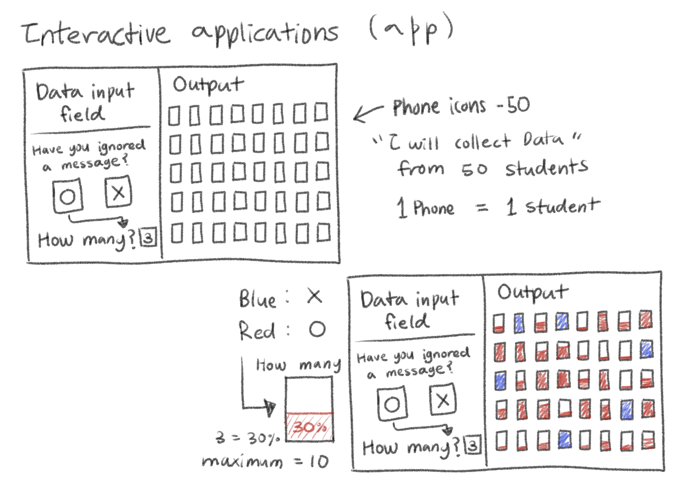
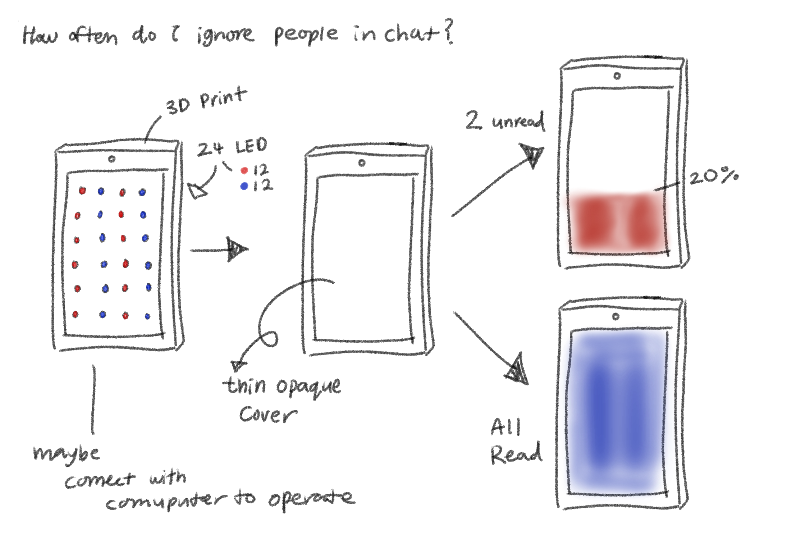

# Reflective Proposal

[← Back to Home](../index.md)

## Review and Reflect
The first experiment, Data Drawings, was the most interesting of all the experiments we did. In this experiment, I set the topic “Where do I space out the most?” and recorded moments from my daily life. I found the idea of recording my personal habits as data interesting. Although it seemed simple at first, it was more difficult than I expected. I often missed or forgot moments, or didn’t recognise when I was spacing out, so the data became imperfect. This made me realise that data is not always accurate and that even incomplete records can still be meaningful.

This experience is closely connected to the concept of data humanism discussed in class. Giorgia Lupi suggests that data can represent personal experiences and emotions, not just numbers. I came to understand that incorporating human context is important, even if the data is imperfect. The third experiment, Live Data, was also interesting because using APIs to create visual responses from real-time data showed new possibilities. However, I relied on LLM-based coding, so I did not fully understand the entire process.

Despite this, I realised that these tools allow me to create the results I want, which made me feel more confident about future work. Overall, these experiments made me more interested in data visualisation as a way to deliver experiences rather than just information.

 

## Thematic Focus and Data Source

For this design project, I decided to focus on an everyday behaviour that I have recently become curious about. Although people constantly use smartphones and seem to be always connected, I noticed that many intentionally leave messages unread instead of opening them.

Even though digital environments increase connectivity, actual interaction can become reduced or avoided. On the surface, relationships appear continuous, but people often manage communication by delaying or avoiding engagement altogether.

In this project, I explore the behaviour of intentionally leaving messages unread as a form of data. I see this not simply as a habit or laziness, but as a way people manage emotional distance, attention, and relationships. By visualising this behaviour, I aim to reveal patterns of avoidance and delayed connection that people may not consciously recognise.

A future scenario I considered is one where everyday communication behaviours are increasingly recorded and made visible through data. Simple actions, such as how long a message remains unread or how often someone avoids opening messages, could become indicators of communication style and social behaviour.

Rather than collecting complex datasets, I will gather simple data from design students, focusing on whether they currently have messages they are intentionally leaving unread and how many. The data will be collected anonymously and used as a static dataset, with some simulated data added if needed.

Instead of presenting the data as numbers alone, I aim to translate it into a clear and intuitive visual form so that each person’s behaviour can be understood at a glance. This encourages viewers to reflect on their own communication habits and patterns of avoidance.

This project is connected to Data Humanism, focusing on everyday behavioural data and creating relatable visualisations. It will be presented as a physical installation so the audience can experience the data in space rather than just on a screen.

 

## Visualisation & Impact

*Idea 1: Interactive Application*

No need to read (for better understanding)
~~The app displays 50 phone screens. Each phone represents the number of messages a user is intentionally leaving unread, with more unread messages shown through increasing red indicators, while no unread messages turn the screen blue.~~

 

*Idea 2: 3D Print*

No need to read (for better understanding)
~~Based on Idea 1, physical phone models will be created. Each phone represents one person’s data, with LEDs indicating the number of messages intentionally left unread as a visual gauge (red increases with more unread messages, while blue indicates none). The lights update dynamically based on the input data.~~

 

**Impact:**
The audience is encouraged to recognise their own behaviour and see it from a new perspective. By focusing on messages that are intentionally left unread, this project aims to turn simple data into an experience that reveals hidden patterns of avoidance in everyday communication.

