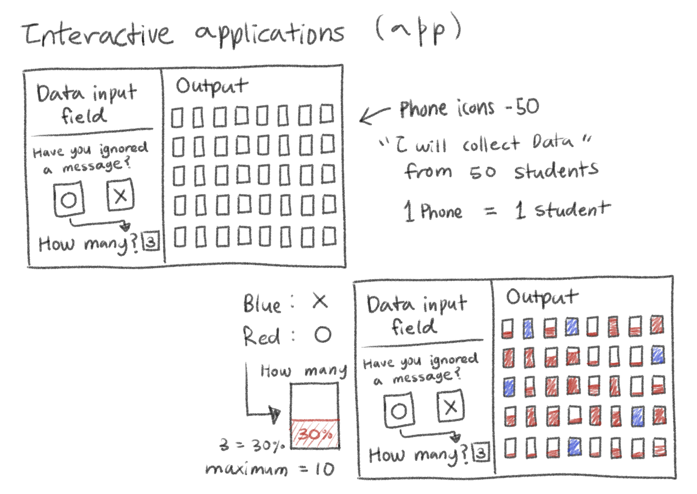
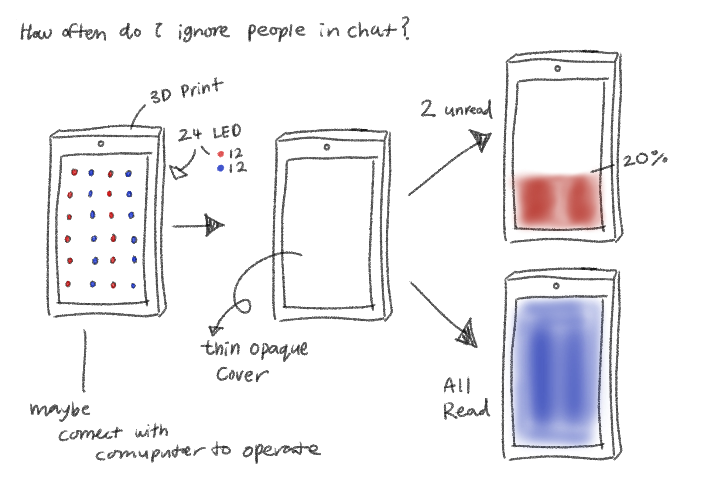
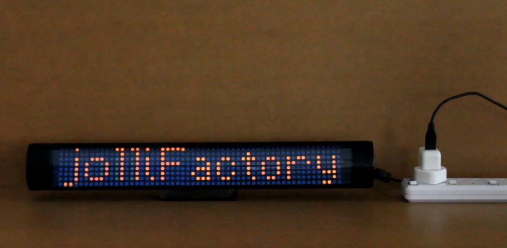
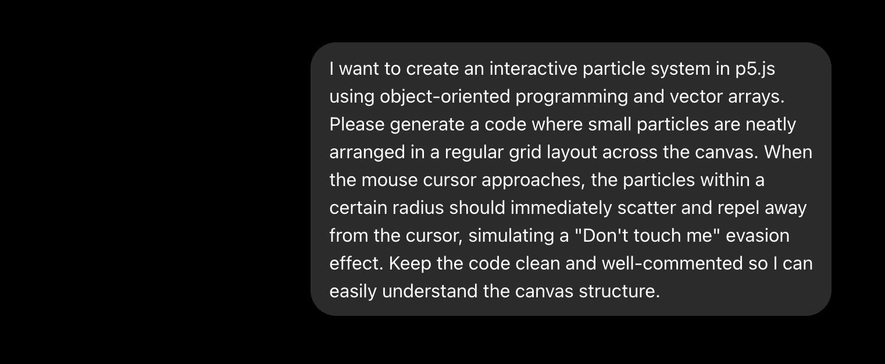
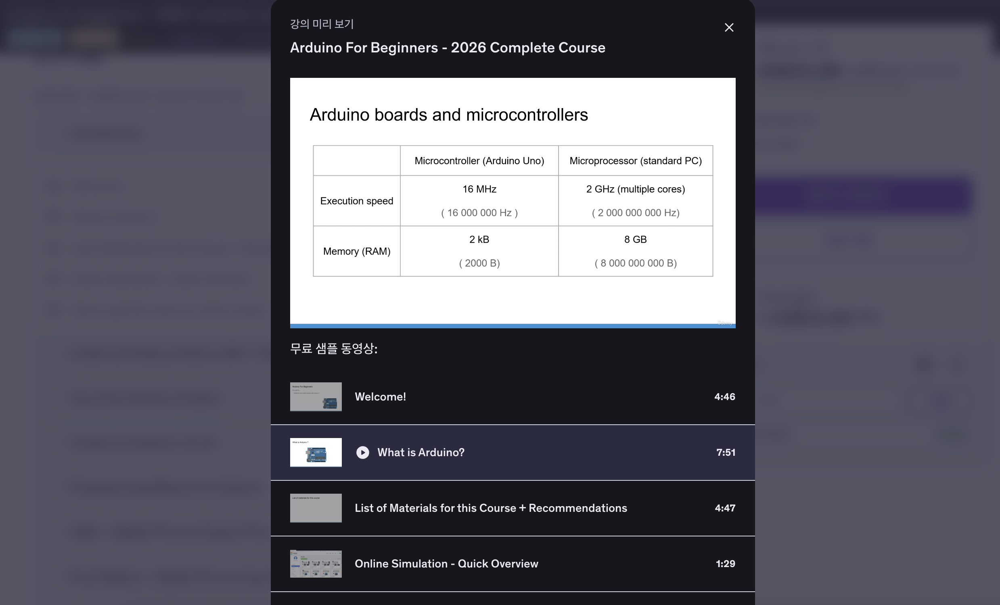
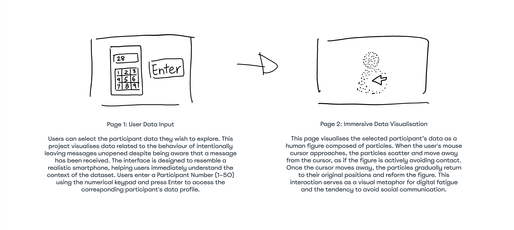

# Week 06
---
[← Back to Home](../index.md)

# In-Class Activities
---
1. Data Exploration
2. Visual Research and Precedent Study
3. Project Planning and Skills Roadmap

 

## 1. Data Exploration
---
My data source is based on everyday communication behaviour, specifically focusing on the act of intentionally leaving messages unread. This project aims to explore not only the behaviour itself but also the psychological aspects behind it. The data will be collected from approximately 50 design students in this class through a simple survey. This group was chosen because participants are easily accessible within the same class environment. To ensure ethical data management, the survey will be conducted with explicit participant consent, and all collected data will be kept strictly anonymous to protect privacy. Participants will be asked whether they currently have any messages they are intentionally leaving unread and, if so, how many messages they are leaving unopened at that moment. (The number of participants may be adjusted if necessary.) At this stage, I plan to collect a minimal dataset focused on the presence and quantity of unread messages, keeping the structure simple and manageable.

I have developed two possible directions for visualising this data: 

#### 1. Online interactive outcome
\
*(Image 1: Online interactive outcome)* 

The first is an online interactive outcome, where all participants’ data can be displayed together in a clear and accessible format. For example, users could view an overview of all data and click on individual entries to reveal more detailed information. This format also opens up the possibility of expanding the dataset in the future, such as including time-based data or categories of unread messages.

#### 2. 3D printed physical output

\
*(Image 2: 3D printed physical output)*

The second direction is a 3D printed physical output. Due to spatial and technical limitations, it would be difficult to represent all participants’ data at once. Instead, this approach would focus on displaying one individual’s data at a time. For example, a single physical object could change its visual state based on the input data, potentially using LED lights to indicate the number of unread messages being left unattended. A key challenge in this approach is understanding how to connect data input to physical output, particularly how LED elements could be controlled through a system, possibly involving a computer or microcontroller. This is an area that requires further research and discussion with the tutor.

**List of questions for the tutor:**
- What tools or platforms are most suitable for controlling LEDs based on data?
- When linking survey data to LEDs, is real-time data integration necessary, or is manual input also acceptable?
- Is there a simple way to connect web-based data with a physical device such as LEDs?
- For beginners, what is the easiest form of physical computing to implement?

One limitation of this dataset is that it relies on self-reporting, which may lead to inaccuracies because participants may not accurately remember or may underestimate their behaviour. I also recognise that the dataset is relatively small and does not represent a wider population. In addition, although complete anonymity helps reduce the risk of social judgement, I think it may also encourage some participants to give less accountable or exaggerated responses. However, from a Data Humanism perspective, I believe that this subjectivity and imperfection can still provide meaningful insights. I feel that the anonymity of the survey is important because it encourages people to be more honest and open about behaviours that they might normally feel uncomfortable admitting. Therefore, rather than focusing on producing objectively precise statistical data, I want this project to encourage people to reflect on their own communication habits and consider how often they avoid responding to messages in their daily lives.

 

## 2. Visual Research and Precedent Study
---
## Online interactive outcome
I explored various examples on the <a href="https://openprocessing.org/browse?q=&time=thisMonth&type=hearts&offset=0#"> 
OpenProcessing website</a> to gain visual inspiration for online interactive data visualisation.

### 1. Tone.js Nuclear Fission 

<a href="https://openprocessing.org/@alwayscodingsomething/2899558"> 
Tone.js Nuclear Fission Link</a>

<iframe width="560" height="315" src="https://www.youtube.com/embed/g51HRziXplw?si=n7TKIwFGOTMjwF6k" title="YouTube video player" frameborder="0" allow="accelerometer; autoplay; clipboard-write; encrypted-media; gyroscope; picture-in-picture; web-share" referrerpolicy="strict-origin-when-cross-origin" allowfullscreen></iframe>

**What draws you to this source?**  
I was impressed by the visual effect where particles multiply exponentially every time the screen is touched, as well as its harmony with the sound. I felt this example is perfect for expressing the digital fatigue of modern people, where accumulating unread messages grow out of control.  
**What will I take into my own work?**  
I want to reference the sound-responsive elements and the mechanism where the data multiplies and expands like cell division whenever the user interacts with the screen. Applying this to my work, it could be a possibility to show the number of unread messages data multiplying like cell division. 
**Does it change or reinforce my direction?**  
It suggests a direction to express the pressure of unread messages through the visual metaphor of multiplication. It could be considered as a strong interactive method to visualise the heavy weight of growing data on an online screen.

 

### 2. Verlet Particle Simulation

<a href="https://openprocessing.org/@ntsutae/2845802">
Verlet Particle Simulation Link</a>

<iframe width="560" height="315" src="https://www.youtube.com/embed/wxKSfhBJgZQ?si=lxJ2Q8g4fZ2hjkdJ" title="YouTube video player" frameborder="0" allow="accelerometer; autoplay; clipboard-write; encrypted-media; gyroscope; picture-in-picture; web-share" referrerpolicy="strict-origin-when-cross-origin" allowfullscreen></iframe>

**What draws you to this source?**  
I found the physics simulation highly appealing, where particles intentionally avoid and scatter away when the mouse cursor approaches. I thought this is very similar to the avoidance behaviour of modern people, who purposely ignore and avoid communication from others even though they know a message has arrived.  
**What will I take into my own work?**  
I want to incorporate the interactive physics feedback that seems to push away and escape from the user's movement. Applying this to my work, it could be a possibility to replace the cursor shape with a message icon. 
**Does it change or reinforce my direction?**  
I believe this reference can help me untangle the psychological distance and avoidance tendencies in human relationships through mouse interaction. I can develop this into an interesting path that allows the audience to physically experience the avoidance of communication.

 

### 3. Don't Touch Me

<a href="https://openprocessing.org/@noel/2812705"> 
Don't Touch Me Link</a>

<iframe width="560" height="315" src="https://www.youtube.com/embed/bvB5vSIyEtY?si=RP4d_wq1pX3opAUg" title="YouTube video player" frameborder="0" allow="accelerometer; autoplay; clipboard-write; encrypted-media; gyroscope; picture-in-picture; web-share" referrerpolicy="strict-origin-when-cross-origin" allowfullscreen></iframe>

**What draws you to this source?**  
Like the previous example, the particles scatter away from the mouse cursor, but I found it fascinating how they have an elastic property to maintain their original circular shape without any gravity. It was impressive to see them break apart when the cursor approaches and then return to their original shape and become isolated again when the cursor moves away. 
**What will I take into my own work?**  
I want to reference this self-maintaining property and implement the basic shape of the particles as a 'human silhouette' instead of a circle. I am planning an interaction where the human shape shatters to avoid contact from others, represented by the mouse, which I plan to change into a message icon, and then pieces back together into the form of an isolated individual once the mouse leaves. 
**Does it change or reinforce my direction?**  
I learned that the psychology of avoiding communication can be attractively expressed through the visual narrative of destruction and restoration of a shape. I can use this to try a psychological visual effect on an online interactive outcome, where the human shape organically deconstructs and recombines based on the user's mouse movements.

 

### 4. Multitap Text

<a href="https://openprocessing.org/@u110137/2703303"> 
Multitap Text Link</a>

<iframe width="560" height="315" src="https://www.youtube.com/embed/9sf_0VguScc?si=VXjLa2opVFd3fMmg" title="YouTube video player" frameborder="0" allow="accelerometer; autoplay; clipboard-write; encrypted-media; gyroscope; picture-in-picture; web-share" referrerpolicy="strict-origin-when-cross-origin" allowfullscreen></iframe>

**What draws you to this source?**  
I was deeply impressed to see a phone model that I had originally planned to build as a physical 3D object, created digitally on a web browser screen and functioning smoothly at the click of a button. 
**What will I take into my own work?**  
I want to incorporate the digital 3D spatial layout and dimensional text design techniques that respond three-dimensionally to mouse movements within a web screen. 
**Does it change or reinforce my direction?**  
I found this to be the definitive turning point to pivot entirely towards an online interactive outcome between my two original options of an online vs. physical 3D project. Through previous assignments in my DES 240 class, I learned vibe coding and became comfortable enough with software implementation, but I had a lot of concerns because physical fabrication was completely new to me. I felt realistic limitations in sourcing the necessary LED components and building a hardware control system from scratch within a limited timeframe. This reference gave me the confidence that I can achieve the same tactile depth and even stronger interaction in a web environment without needing a complex offline structure.

 

### 5. 250430a

<a href="https://openprocessing.org/@okazz/2631454"> 
250430a Link</a>

<iframe width="560" height="315" src="https://www.youtube.com/embed/ZSUqH0pB_uk?si=172tJQcSFBFsJ2_C" title="YouTube video player" frameborder="0" allow="accelerometer; autoplay; clipboard-write; encrypted-media; gyroscope; picture-in-picture; web-share" referrerpolicy="strict-origin-when-cross-origin" allowfullscreen></iframe>

**What draws you to this source?**  
I was impressed by how countless lights and dots move repeatedly to form a single pattern. In particular, I found it fascinating that while the individual elements are simple, they collectively create a complex and captivating visual effect. 
**What will I take into my own work?**  
I want to bring the idea of individual data representation, which I originally planned to implement with physical LEDs, into an online grid layout, borrowing the structure to display the data of the 50 design students I surveyed neatly on a single screen. 
**Does it change or reinforce my direction?**  
I saw the potential to absorb the limitations of physical LEDs into a web grid. I can use this to develop my project to visualise the collected data from 50 participants into a clean, organised 2D or 3D dashboard format that simultaneously displays both collective and individual data.

 

### 6. V6 Puppet

<a href="https://openprocessing.org/@raizada/2654309"> 
V6 Puppet Link</a>

<iframe width="560" height="315" src="https://www.youtube.com/embed/p05LhdgdMr0?si=OHxMZF0r2J9qbtRK" title="YouTube video player" frameborder="0" allow="accelerometer; autoplay; clipboard-write; encrypted-media; gyroscope; picture-in-picture; web-share" referrerpolicy="strict-origin-when-cross-origin" allowfullscreen></iframe>

**What draws you to this source?**  
I found the interaction fascinating, where computer vision technology tracks the user's joints and links them to a digital puppet's movements in real time. 
**What will I take into my own work?**  
Applying this idea, I am considering a visual effect where the camera recognizes the user's body, and a human-shaped graphic is helplessly dragged around, tied to heavy objects or strings that represent the number of unread messages. Since this is not yet finalised, I might try this approach of linking the audience's physical movements and data as a potential option for my project. 
**Does it change or reinforce my direction?**  
I discovered new technical possibilities to move beyond simple mouse clicks and explore interaction driven by body tracking, such as using a camera or sound. To maximise the immersion of the piece, I could explore this as a completely new narrative approach that integrates the audience's real-time physical data.

 

## Physical output
I researched 3D-printed smartphone models and Arduino LED displays to explore physical data visualisation, which ultimately helped me realise the technical limitations and shift towards a web-based outcome.

### 7. Mobile Phone Toy

\
*(Source: Mobile Phone Toy by Neil, available on Printables.com)*

**What draws you to this source?**  
I was drawn to this model while searching for a familiar, 3D-printed phone structure that could intuitively contain my data, since my data source is closely related to smartphone messages. I felt that using a minimal model like this, instead of an actual smartphone, would allow the focus to remain entirely on the data visualisation itself. 
**What will I take into my own work?**  
I wanted to reference the form of this toy smartphone to leave the screen area hollow, allowing me to install an LED light system connected to the coding techniques I explored in the DES 240 class. Specifically, I imagined a physical output where the lights inside the phone model would blink or change colours based on the number of unread messages. 
**Does it change or reinforce my direction?**  
I found that while this reference helped me imagine the specific form of my original physical output idea, it ultimately served as the reason to pivot entirely towards an online interactive outcome. I realised that sourcing and assembling a hardware control system inside this kind of physical model poses too many technical and realistic limitations within a restricted timeframe as a beginner.

 

### 8. Arduino Smart LED Matrix Display

\
*(Source: Arduino Smart LED Matrix Display by Instructables, available on Instructables.com)*

**What draws you to this source?**  
I was fascinated by the physical computing structure that takes sensor or external data and controls LED blinking and text patterns in real time. I found it highly relevant to my initial idea because it instantly translates unread messages or notifications into physical light signals in a real-world space. 
**What will I take into my own work?**  
I wanted to reference this device by assembling an Arduino and LED components to create a physical notification object, where the lights would intensify or flash like a red warning light as the number of unread messages grows. I considered an approach to visualise the average digital fatigue of the 50 students into a single physical machine. 
**Does it change or reinforce my direction?**  
I found that while this reference helped me imagine the specific circuitry of a physical output, it ultimately served as another reason to shift towards an online interactive outcome. I realised that programming hardware and handling an LED matrix requires additional electronics knowledge and complex assembly beyond the software coding I learned in DES 240. Given the technical learning curve for a beginner and the limited timeframe, I became confident that developing the project within a web browser would allow me to achieve compelling 3D depth and richer interactivity much more efficiently.

 

## 3. Project Planning and Skills Roadmap
---
### 3.1 What do I need to make?
I need to create a web-based, two-stage 3D interactive data visualisation that explores the digital fatigue of 50 design students through their unread messages and communication avoidance. Inspired by 'Multitap Text', the initial interface will feature a realistic smartphone screen layout equipped with a functional numeric keypad from 1 to 0, allowing viewers to type a specific number into the entry window and press 'Enter' to look up a student's profile. Once submitted, the screen will fluidly transition into an immersive 3D canvas where particle-based human forms are displayed, with the exact number of these silhouettes dynamically determined by the selected student's data—specifically representing the number of people currently left unread by that individual. Based on the elastic particle system of 'Don't touch me', these human structures will dramatically shatter and scatter into fragmented grains when the user's cursor approaches, symbolising the intense psychological pressure of digital communication and the breaking of social relationships, and will organically recombine once the cursor moves away. By combining this interactive numeric entry screen with a deeply visceral human particle visualisation, I will build a compelling digital environment that makes both the collective and individual weight of digital fatigue visible and testable.

 

### 3.2 What do I need to learn?
1. **P5.js Coding Skills:** The main skill I need to improve is my ability to use p5.js. I have experimented with it before through AI-assisted coding in a previous DES240 project, but I have never properly learnt it. Because of this, I want to spend more time learning how it works and improving my skills. I also plan to experiment with different AI tools to see which ones best understand and support the kind of visual outcomes I want to create. 

2. **Developing the Final Outcome Further:** I still need to develop my final outcome further. One thing I am interested in is incorporating a camera feature, similar to some of the examples I researched. However, I am not yet sure how I would apply it, so I have currently removed it from my idea. If I learn more about the technology and gain a better understanding of how to use it, I would like to try incorporating it into my final project. Another thing I am considering is how to present the data. My current idea is to visualise the data from all 50 students individually, but I think this may be quite difficult to implement. Because of this, I am also considering averaging the data from all 50 students and creating a single visual outcome that represents the overall result.

3. **Considering a 3D Printed Physical Output:**
Although I have currently decided to move in an online interactive direction, I still really like the idea of creating a 3D printed physical output, so I feel it would be a waste to completely let it go. I plan to ask my lecturer the questions I have prepared and get feedback before making a final decision. Rather than giving up on the idea straight away, I want to explore whether it is still a realistic option.

 

### 3.3 What are my next steps?
To gather foundational data for the project, I will design a primary research survey tailored for design students. The questionnaire is structured with an explicit participant assent section at the beginning to secure informed consent and guarantee complete anonymity. The core survey items focus on unread messaging behaviours through the following framework:

1. There are currently received messages that remain unread and unanswered.
- 1.1 How many unread messages do you currently have?
- 1.2 What is the primary reason for leaving them unread? (optional)
2. There are currently no unread or unanswered messages.

To develop the project deeply into a single, cohesive direction, my immediate next step is to consult with my tutor regarding the final output medium. I will discuss whether to pursue a screen based application or a physical hardware setup to determine which path is more viable for the final showcase. Once this strategic decision is made, I will set up a local p5.js development environment to initiate simple interactive experiments, focusing on how numerical data inputs from the survey can dynamically alter foundational particle densities on the canvas. This will establish a secure and robust foundation before distributing the final survey to 50 design students.

 

# Independent Study
---
1. Consultation Reflection
2. Technical Skill Building
3. Initial Concept Sketch

 

## 1. Consultation Reflection
---
After discussing my proposal with my tutor, I realised that I still have not fully decided on the final direction of the project. However, the discussion helped me think more specifically about how I will collect and manage my data. I was not able to ask all of my questions during the meeting, so I plan to ask the remaining questions next week. For now, I have decided to include participant consent in the survey process and collect all responses anonymously from the 50 design students in my class. The feedback also made me realise that I need to further develop the critical framework of my research. At first, I thought that reading a message and not replying was simply a matter of being lazy or a common communication habit. However, after thinking about it more deeply, I found it interesting that this behaviour could also be connected to avoidance, relationship management, social expectations, or even power dynamics between people. Because of this, I would like to move beyond simply showing the phenomenon of ignored messages and further explore what this behaviour might reveal about contemporary digital communication. At the moment, I am leaning more towards an online interactive outcome. However, I still feel reluctant to completely let go of the idea of a 3D printed physical output. Since both directions have their own advantages and disadvantages, I plan to ask my tutor the remaining questions next week before making a final decision.

 

## 2. Technical Skill Building
---
I find that according to the skills roadmap, my highest priority technical gap is exploring the tools needed for both web coding and physical hardware to evaluate which path is more feasible for my project. Honestly, I do not know how to write code manually from scratch. Therefore, finding the right AI tools for vibe coding is not just a shortcut for me, but an essential step to bridge my fundamental technical gap. My goal this week is to identifying a specific AI tool that thoroughly understands p5.js canvas structures and vector arrays so that I can guide the development effectively through conversational instructions.

*(Source: AI Prompt for p5js Particle Grid by hyun986)*

At the same time, I did some online research and discovered Arduino, an open source microcontroller hardware and software platform that makes it easy to control components like LEDs, sensors, and motors. I am currently watching several video tutorials to understand how the Arduino software interacts with the physical components. Honestly, I find grasping these hardware concepts much slower and more challenging compared to web based platforms. However, since this is still the initial stage, I am continuously evaluating the difficulty level. After watching more detailed instructional videos and discussing these challenges with my tutor next week, I plan to definitively choose one specific direction to finalise my project path.

*(Source: Arduino For Beginners by Edouard Renard, available on Udemy.com)*

 

## 3. Initial Concept Sketch
---

<iframe src="https://editor.p5js.org/hyun986/full/t6jPYnEWk9" height="600" width="600"></iframe>

*(Source: Particle Grid via Gemini by hyun986, available on editor.p5js.org)*   

<iframe src="https://editor.p5js.org/hyun986/full/8wdGN3-YF" height="600" width="600"></iframe>

*(Source: Particle Grid via ChatGPT by hyun986, available on editor.p5js.org)*   

<iframe src="https://editor.p5js.org/hyun986/full/73AmfagmV" height="600" width="600"></iframe>

*(Source: Particle Grid via Codex by hyun986, available on editor.p5js.org)*   

 

# References
---
## Web-based Interactive Coding

- OpenProcessing Platform. (n.d.) Creative Coding Community Browser and Hearted Sketches. Available at: https://openprocessing.org/browse?q=&time=thisMonth&type=hearts&offset=0#

- alwayscodingsomething. (n.d.) Interactive Sketch Showcase on OpenProcessing. Available at: https://openprocessing.org/@alwayscodingsomething/2899558

- ntsutae. (n.d.) Interactive Sketch Showcase on OpenProcessing. Available at: https://openprocessing.org/@ntsutae/2845802

- noel. (n.d.) Interactive Sketch Showcase on OpenProcessing. Available at: https://openprocessing.org/@noel/2812705

- u110137. (n.d.) Interactive Sketch Showcase on OpenProcessing. Available at: https://openprocessing.org/@u110137/2703303

- okazz. (n.d.) Interactive Sketch Showcase on OpenProcessing. Available at: https://openprocessing.org/@okazz/2631454

- raizada. (n.d.) Interactive Sketch Showcase on OpenProcessing. Available at: https://openprocessing.org/@raizada/2654309

## Physical Hardware and 3D Modelling

- Marin. (2024) Mobile Phone Toy 3D Printing Model on Printables. Available at: https://www.printables.com/model/91260-mobile-phone-toy

- Instructables. (n.d.) Arduino SPI 7 Bi colour LED Matrix Scrolling Text Display Guide. Available at: https://www.instructables.com/Arduino-SPI-7-Bi-color-LED-Matrix-Scrolling-Text-D/

## Technical Education Course

- Renard, E. (2026) Arduino For Beginners Video Course on Udemy. Available at: https://www.udemy.com/share/104gCs/

## AI Usage Statement

- OpenAI. (2026). ChatGPT (GPT-5.5) [Large language model]. https://chatgpt.com

- Google. (2026). Gemini [Large language model]. https://gemini.google.com

- OpenAI. (2026). Codex [AI coding model]. https://openai.com

ChatGPT (GPT-5.5), Google Gemini, and OpenAI Codex were used only for coding assistance during the development of the p5.js prototype. These tools helped generate and explain example code for experimentation and testing. All final implementation and project decisions were completed by me.
