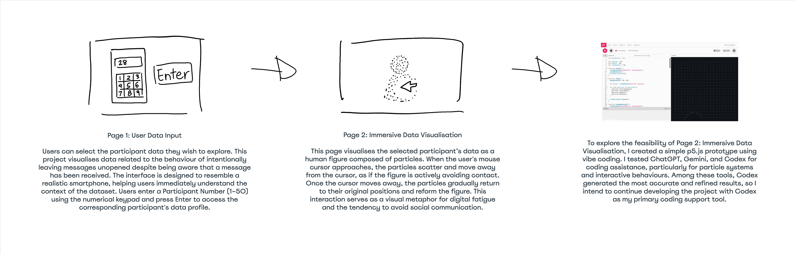
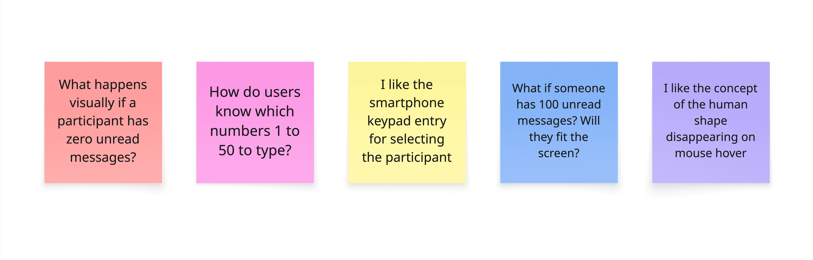

# Week 07
---
[← Back to Home](../index.md)

# In-Class Activities
---
Due to a severe cold, I was unable to attend the Week 7 class in person and therefore completed all in-class activities independently from home.

1. Concept Sketches
2. Making Sprint
3. What if Variations

 

## 1. Concept Sketches
---
### 1.1 Initial Concept Sketch

*(Figure: Week 6 initial sketches and the early interactive prototype developed through generative AI codex programming to establish the project atmosphere.)*   

<iframe src="https://editor.p5js.org/hyun986/full/73AmfagmV" height="600" width="600"></iframe>

*(Source: Particle Grid via Codex by hyun986, available on editor.p5js.org)*   

### 1.2 Idea Development Based on Feedback

*(Figure: Screenshot of the Miro board showing Week 7 peer feedback)*  
As I was unable to attend the studio session in person due to illness, I asked a classmate in DES240 to provide feedback online. Since I have a limited network within the course, I also sought feedback from a student studying design in another course. This allowed me to gain new perspectives on my conceptual sketches and helped further develop the project.

#### 1. Changes to the Data Representation

The most thought provoking piece of feedback was the question: “What happens visually if a participant has zero unread messages?” My original concept mainly focused on participants who had unread messages, so I had not fully considered how the visualisation would behave when the value was zero. However, simply displaying an empty canvas when the data value is zero would feel visually weak and unengaging. This feedback encouraged me to rethink how the data should be represented.  
Initially, I planned to increase the number of human figures according to the number of unread messages. However, I am now considering maintaining a single human figure while varying its colour, particle density, or interaction intensity. For example, participants with more unread messages could trigger a stronger repulsion effect, causing the particles to scatter further away from the cursor. In contrast, when the unread message count is zero, the figure would remain stable and calm without dispersing. This approach would allow the interaction itself to communicate the data. It could visually suggest that as the number of unread messages increases, the participant becomes more overwhelmed or defensive towards social communication. I believe this approach represents message avoidance behaviour more effectively than my original concept.

#### 2. Expanding from Individual Data to Group Data

Another piece of feedback questioned how users would know which participant number (1–50) to enter. Since the data was collected anonymously, it made me reconsider whether allowing users to access individual participant profiles is the most meaningful interaction. 
This feedback also reminded me of my tutor’s suggestion in Week 6 to consider demographic categories such as gender. As a result, I am now exploring the possibility of visualising group data rather than individual participants. For example, I could compare the average behaviours of male and female design students, or visualise differences between age groups. This approach may reveal broader patterns within the dataset and provide more meaningful insights than focusing on a single anonymous participant. It could also help users understand differences within the data more intuitively.

#### 3. Positive Feedback on the Existing Concept

On the other hand, the positive feedback regarding the smartphone keypad interface and the human figure that scatters away from the mouse cursor aligned closely with my original intentions. These comments reinforced my belief that the interaction successfully communicates themes of digital fatigue and communication avoidance. As a result, I plan to continue developing and refining these aspects of the project.   

### 1.3 Developed Concept Sketch
(add image)

 

## 2. Making Sprint
---
<iframe src="https://editor.p5js.org/hyun986/full/duyGyqZnV" height="500" width="350"></iframe>

## 2. What if Variations
---