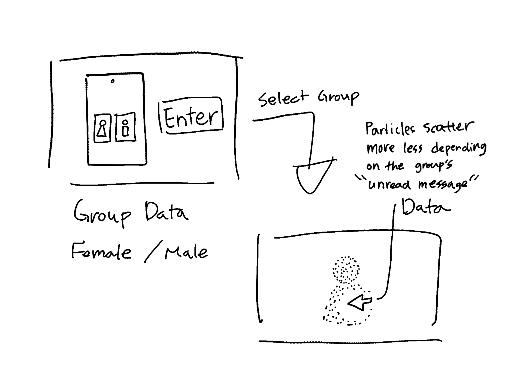
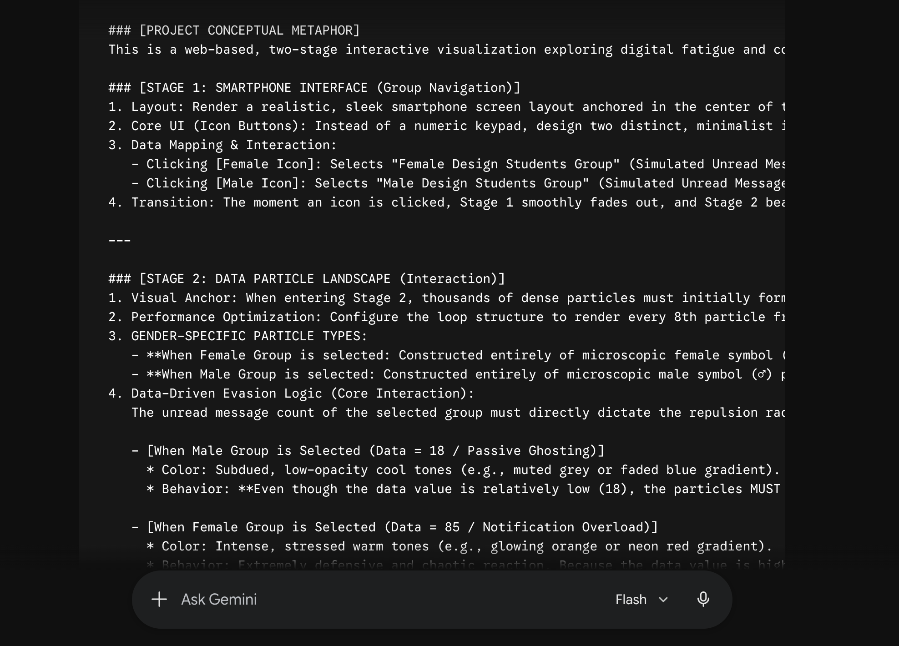
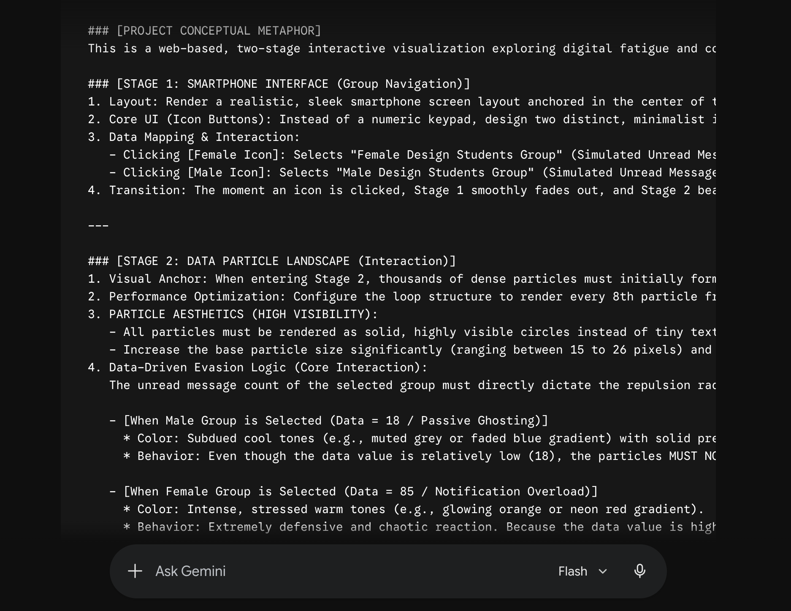
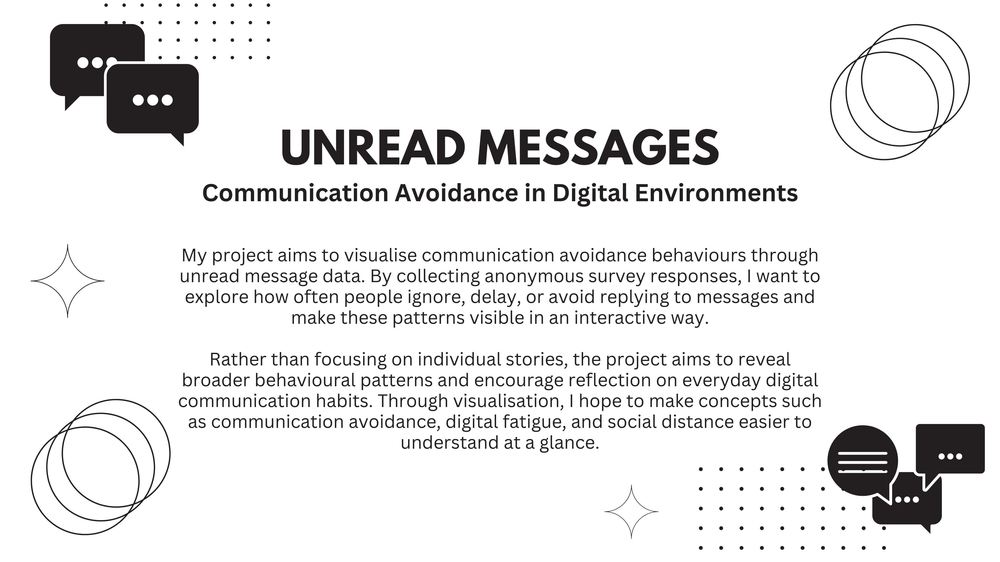
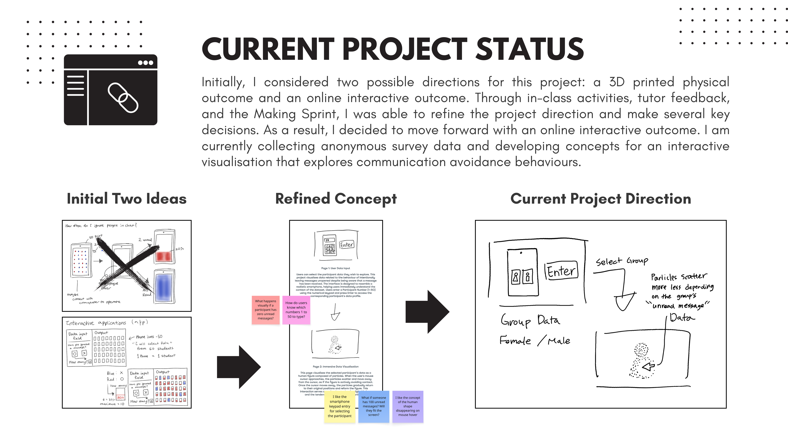
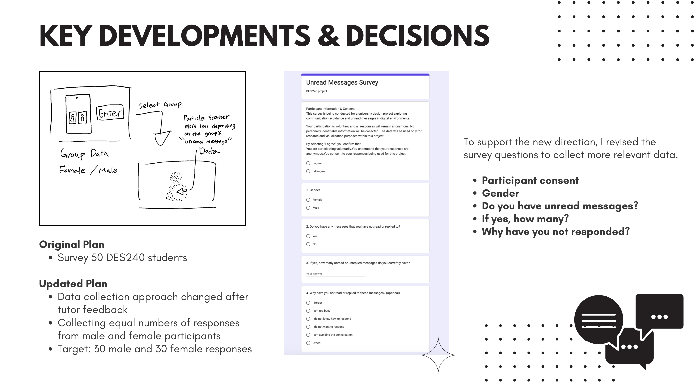
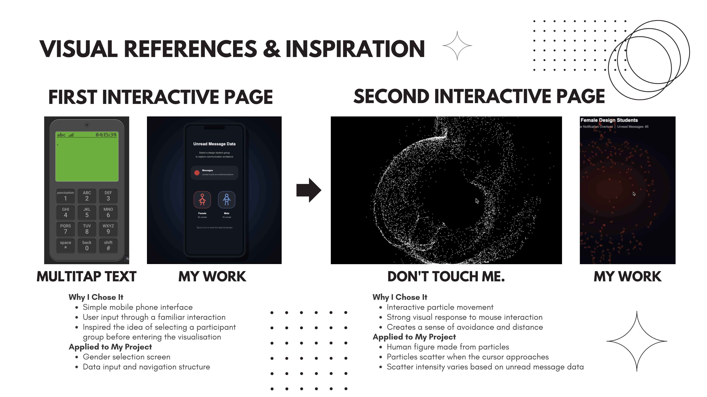

# Week 07
---
[← Back to Home](../index.md)

# In-Class Activities
---
I was unable to attend the Week 7 class due to illness, so I completed the in-class activities independently from home.

1. Concept Sketches
2. Making Sprint
3. What if Variations

 

## 1. Concept Sketches
---
### 1.1 Initial Concept Sketch

*(Figure: Week 6 initial sketches and the early interactive prototype developed through generative AI codex programming to establish the project atmosphere.)*   

<iframe src="https://editor.p5js.org/hyun986/full/73AmfagmV" height="600" width="600"></iframe>

*(Source: Particle Grid via Codex by hyun986, available on editor.p5js.org)*   

### 1.2 Idea Development Based on Feedback

*(Figure: Screenshot of the Miro board showing Week 7 peer feedback)*  
As I was unable to attend the studio session in person due to illness, I asked a classmate in DES240 to provide feedback online. Since I have a limited network within the course, I also sought feedback from a student studying design in another course. This allowed me to gain new perspectives on my conceptual sketches and helped further develop the project.

**1. Changes to the Data Representation**: The most thought provoking piece of feedback was the question: “What happens visually if a participant has zero unread messages?” My original concept mainly focused on participants who had unread messages, so I had not fully considered how the visualisation would behave when the value was zero. However, simply displaying an empty canvas when the data value is zero would feel visually weak and unengaging. This feedback encouraged me to rethink how the data should be represented. Initially, I planned to increase the number of human figures according to the number of unread messages. However, I am now considering maintaining a single human figure while varying its colour, particle density, or interaction intensity. For example, participants with more unread messages could trigger a stronger repulsion effect, causing the particles to scatter further away from the cursor. In contrast, when the unread message count is zero, the figure would remain stable and calm without dispersing. This approach would allow the interaction itself to communicate the data. It could visually suggest that as the number of unread messages increases, the participant becomes more overwhelmed or defensive towards social communication. I believe this approach represents message avoidance behaviour more effectively than my original concept.

**2. Expanding from Individual Data to Group Data:** Another piece of feedback questioned how users would know which participant number (1–50) to enter. Since the data was collected anonymously, it made me reconsider whether allowing users to access individual participant profiles is the most meaningful interaction. 
This feedback also reminded me of my tutor’s suggestion in Week 6 to consider demographic categories such as gender. As a result, I am now exploring the possibility of visualising group data rather than individual participants. For example, I could compare the average behaviours of male and female design students, or visualise differences between age groups. This approach may reveal broader patterns within the dataset and provide more meaningful insights than focusing on a single anonymous participant. It could also help users understand differences within the data more intuitively.

**3. Positive Feedback on the Existing Concept:** On the other hand, the positive feedback regarding the smartphone keypad interface and the human figure that scatters away from the mouse cursor aligned closely with my original intentions. These comments reinforced my belief that the interaction successfully communicates themes of digital fatigue and communication avoidance. As a result, I plan to continue developing and refining these aspects of the project.   

### 1.3 Developed Concept Sketch

*(figure: sketch showing the grouped particle concept)*

 

---

## 2. Making Sprint

### 1. Research & Hypothesis
Before collecting primary data, secondary research was conducted to analyze gender differences in mobile communication styles and to establish the core project hypothesis. According to academic literature on mediated communication (Kimbrough et al., 2013), women place a significantly higher value on mobile messaging and social media to maintain emotional connections and relationships compared to men.

Project Hypothesis: 
Building upon the fact that women prioritize messaging more deeply, this project proposes a unique hypothesis: "The high importance and psychological obligation women place on communication will paradoxically trigger digital fatigue, making them more likely than men to deliberately leave messages unread and intentionally delay replies (intentional unread avoidance) to protect their personal boundaries."

Virtual Data Mapping:
- Female Group (Simulated Data = 85): Represents a state of high intentional avoidance and notification pressure.
- Male Group (Simulated Data = 18): Represents a state of passive detachment or neglect due to lower baseline communication investment.

### 2. Prototype 1

<iframe src="https://editor.p5js.org/hyun986/full/duyGyqZnV" height="600" width="400"></iframe>

*(Source: Prototype 1 generated with OpenAI Codex by hyun986, available on editor.p5js.org)*

To quickly test the proposed concept and interaction mechanics, I developed an initial web-based prototype with the assistance of Google Gemini.

*(Figure. Prompt development process for Prototype 1 using Google Gemini)*

### 3. Prototype 2

<iframe src="https://editor.p5js.org/hyun986/full/yqlPKt_fK" height="600" width="400"></iframe>

*(Source: Prototype 2 generated with OpenAI Codex by hyun986, available on editor.p5js.org)*

To address the issues identified in Prototype 1, I revised the interaction logic and visual design before submitting an updated prompt to the AI.

#### Key Improvements
- **Smartphone UI Optimisation:** Updated to a 19.5:9 aspect ratio to better reflect modern smartphone screens and improve immersion.
- **Improved Male Group Interaction:** Added a subtle "Passive Ghosting" behaviour, allowing particles to gently drift away from the cursor instead of remaining almost static.
- **Refined Human Silhouette:** Redesigned the human figure with clearer and more symmetrical body shapes, including distinct shirt and skirt forms.
- **Enhanced Particle Visibility:** Replaced small symbol-based particles with larger solid circular particles to improve clarity and strengthen the visual impact of the interaction.

*(Figure. Prompt development process for Prototype 2 using Google Gemini)*

 

## 3. What if Variations
---

My partner Yeseul suggested three alternative “What If” scenarios:

- "What if, instead of avoiding the cursor, the human figure gradually became trapped by unread messages?"
- "What if the unread message count physically changed the shape of the human figure?"
- "What if multiple human figures moved further apart from one another as unread message counts increased, visualising social disconnection?"

Among these suggestions, the idea of multiple human figures moving further apart as unread message counts increased had the most influence on my project.

My current project focuses on an individual’s communication avoidance through a single human figure that scatters away from the mouse cursor. However, this scenario encouraged me to think beyond individual behaviour and consider how unread messages might affect relationships between people. For example, multiple human figures could exist within the same visual space, with increasing numbers of unread messages causing the figures to gradually move farther apart. Conversely, lower unread message counts could allow the figures to remain closer together, suggesting stronger social connections. This approach extends the project beyond visualising individual digital fatigue and opens up the possibility of representing social disconnection and weakened relationships within digital environments. I think this idea could help develop the project further by looking at communication avoidance not only from an individual’s perspective but also from a social perspective. Instead of focusing on just one person, it could show how unread messages affect relationships between multiple people and create a sense of distance between them. I also think this approach would make the project more interesting because it allows me to visualise both individual behaviour and the connections between people simply and understandably.

 

# Independent Study
---
1. Project Development & Skill Building
2. Progress Report

 

## 1. Project Development & Skill Building
--- 

### Addressing the Technical Gaps Identified in the Week 6 Roadmap

In Week 6, I planned to first discuss my questions with my tutor and then decide whether to pursue a physical outcome or an online interactive outcome.

Last week, I spent time researching relevant tutorials and resources before discussing my prepared questions with my tutor. In particular, I looked into the technologies and software needed to create a physical outcome using components such as LEDs. However, after conducting further research, I felt that achieving the quality of final outcome I wanted would be difficult within the time remaining for the project. In addition, working with Arduino appeared to require not only hardware integration but also additional technical and making skills. Given the limited timeframe, I decided that learning these skills to a sufficient level would be challenging. As a result, I decided not to continue with the physical outcome direction and instead focus on developing an online interactive outcome from this week onward.

To support this online interactive outcome approach, I compared several AI tools during Week 6 and found that Codex produced the most detailed and highest-quality results for the type of outcome I wanted to create. Therefore, I have decided to use Codex as my main development tool. However, I found that simply asking general questions did not always produce the desired results. Because of this, I plan to use Gemini to generate more detailed prompts that clearly describe the visual style and functionality I want, and then use those prompts within Codex to develop the project.

### Project Development

This week's in-class activities and Making Sprint provided me with many new perspectives and ideas for the project. In particular, sharing my sketches and receiving feedback helped me identify several issues that I had not previously noticed. This process encouraged me to think about possible improvements and alternative approaches.

In addition, after the Making Sprint, I exchanged feedback with my partner Yeseul and gained further inspiration from discussing our outcomes. One idea that stood out to me was the possibility of visualising not only the impact of unread messages on an individual, but also the effects they may have on relationships and social distance between people. These discussions and reflections have provided several new directions that I would like to explore further as I continue developing the project.

### Making Process

During the Making Sprint, I mainly explored ideas without using real data. However, I realised that collecting actual data would be necessary in order to develop the project further. Because of this, I focused on data collection rather than outcome production this week.

As the direction of my project has evolved, I have moved away from visualising each individual's data separately and have instead become more interested in comparing average data between male and female groups. As a result, I felt that the original target of 50 participants might not provide enough data for this approach. Therefore, I decided to collect an equal number of responses from male and female participants to improve the reliability of the analysis.

To achieve this, I distributed an anonymous survey not only to DES240 students but also to other students within the Design programme. All participants were informed about the purpose of the research and provided consent before completing the survey. At this stage, I am still collecting responses and building the dataset.

Overall, this week was focused more on data collection and refining the project direction than on producing the final outcome itself. Once sufficient data has been collected, I plan to begin creating the visualisations and developing the online interactive outcome next week.

 

## 2. Progress Report
---

*(Figure: Presentation Slide 1)*

 
*(Figure: Presentation Slide 2)*

 
*(Figure: Presentation Slide 3)*

 
*(Figure: Presentation Slide 4)*

*(Figure: Presentation Slide 5)*

 

# References
---
Kimbrough, A. M., Guadagno, R. E., Muscanell, N. L., & Dill, J. (2013). Gender differences in mediated communication: Women connect more than do men. Computers in Human Behavior, 29(3), 896–900. https://doi.org/10.1016/j.chb.2012.12.005

### AI Usage Statement

- Google. (2026). Gemini [Large language model]. https://gemini.google.com

- OpenAI. (2026). Codex [AI coding model]. https://openai.com

Google Gemini and OpenAI Codex were used as coding support tools during the development of the p5.js prototype. These tools were used to generate prompts, produce example code, troubleshoot programming errors, and explore different programming approaches. All final design decisions, data mappings, code selection, refinements, and project outcomes were developed and evaluated by Hyein Yun.