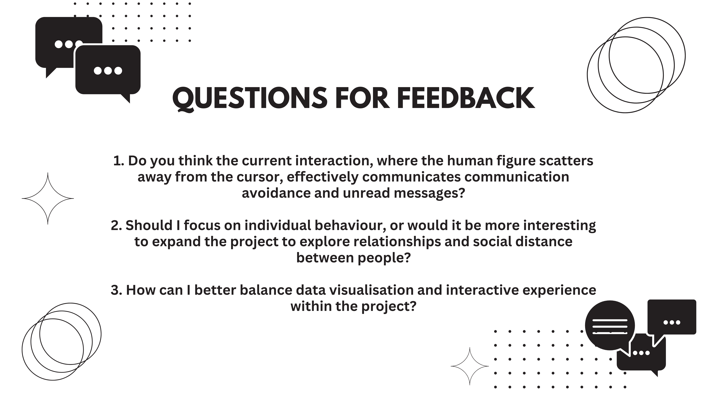
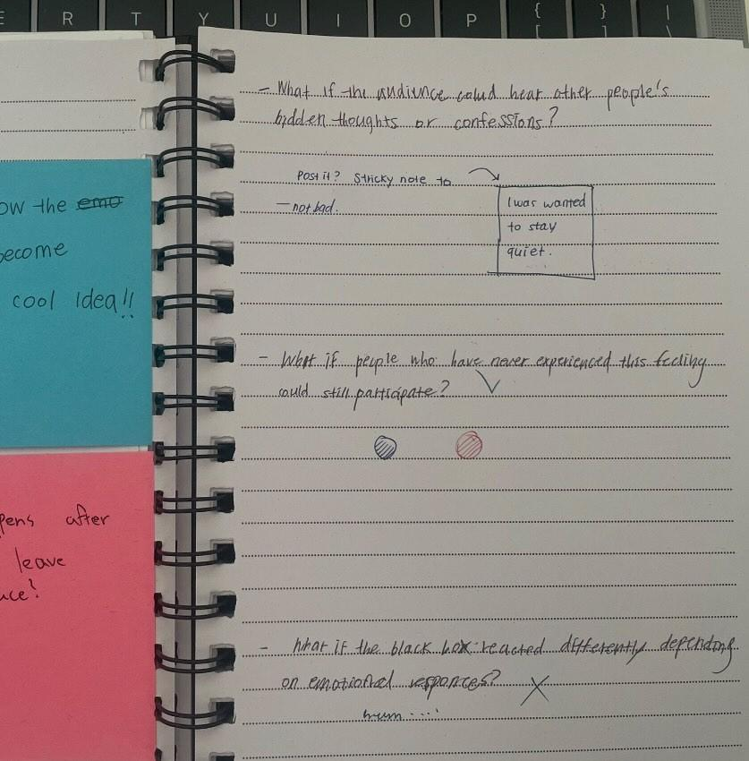
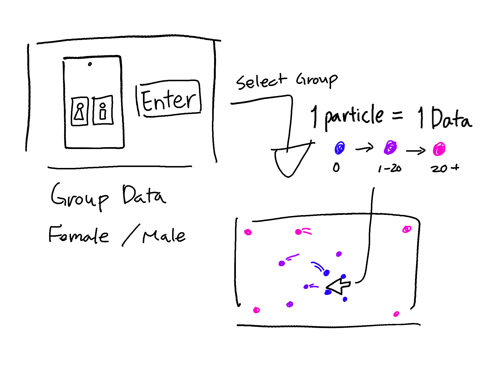
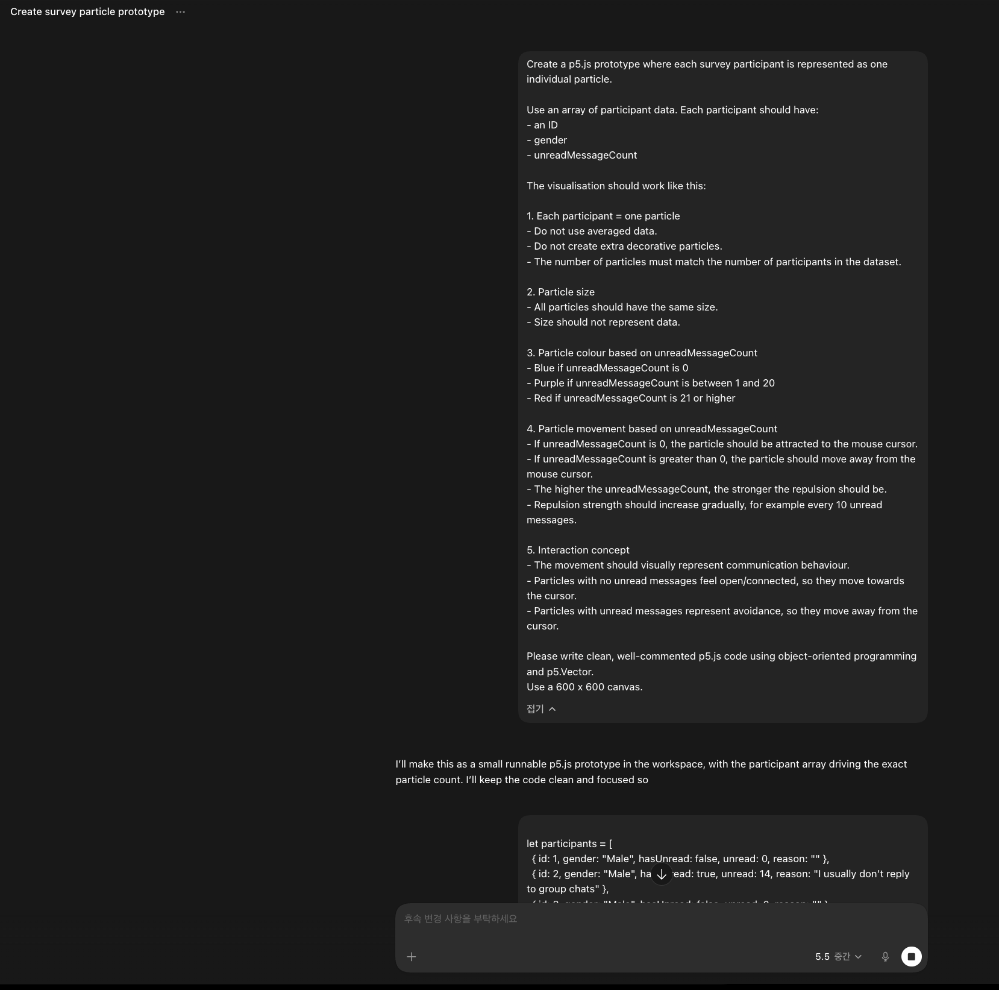

# Week 08
---

[← Back to Home](../index.md)

# In-Class Activities
---

## 1. Progress Reports 

*(Figure: Presentation Slide 5)*

During this week 8 progress presentation, I shared slides with my small group that briefly explained the current direction of my project and the concept for the interactive installation.

The feedback I received from my teammates was as follows:

- “The interaction where the figures move away from the cursor feels intuitive and engaging.”
- “Participants with more unread messages could be placed farther apart or shown with weaker connections to represent disconnection.”
- “Using individual participant data rather than only averages could make the project more engaging and persuasive.”
- “One of the project’s strengths is that it allows audiences to experience communication avoidance through interaction.”
- “It could also be interesting to visualise relationships between multiple people, not just individual behaviour.”

The most helpful feedback I received was related to the way I was representing the data. My teammates suggested that while presenting survey data as averages or grouped data could be meaningful, the project might become more engaging and convincing if it also reflected the personal data and context of individual participants. This feedback encouraged me to reconsider an approach that I had previously abandoned. In the early stages of the project, I planned to visualise each participant's data individually. However, I encountered a problem when trying to represent participants who had no unread or unanswered messages. Because of this, I decided to average the data and present it at a group level instead. While this solved some of the design challenges, I felt that it also removed the individuality of the participants and made the data overly generalised.

As a result of this feedback, a new idea emerged. I would still keep the initial screen where users select either the male or female group. However, instead of displaying a single averaged dataset, I am considering representing each participant as an individual particle. Previously, I designed a large number of particles that all reacted in the same way for visual effect. Now, I am exploring the possibility of allowing each particle to represent a specific participant and their survey response. For example, particles representing participants with unread or unanswered messages could move away when the mouse cursor approaches, while particles representing participants with no unread or unanswered messages could move towards or follow the cursor. This approach could communicate individual differences more clearly than an averaged visualisation and strengthen the connection between the interaction and the concept of communication avoidance. If I continue developing the project in this direction, I may no longer need to limit the dataset to 30 male and 30 female participants. Since the survey does not have a participant limit, I hope to collect responses from as many people as possible and incorporate all of them into the visualisation. This would allow me to highlight the diversity of individual communication behaviours rather than hiding them behind a single average value.

 

---

## 2. Critical Design Propositions

In this activity, I partnered with Yeseul to present my project and exchange feedback.

### Feedback I Gave to My Peer

- What if the audience could hear other people's hidden thoughts or confessions?
- What if people who have never experienced this feeling could still participate?
- What if the black box reacted differently depending on emotional responses?

I was particularly interested in how the project used the black box to reveal invisible emotions and personal experiences. However, I felt there was an opportunity to further develop the audience's role within the experience. My suggestions focused on creating stronger interaction and allowing participants to engage more directly with the emotions and stories being presented.

### Feedback from Yeseul
Yeseul said that the second interaction was the most interesting. She found the way the human-shaped particles scattered when the mouse approached intuitive, as it resembled the act of avoiding communication. However, she mentioned that it was difficult to immediately understand why the particles were moving away until I explained the concept. In her opinion, the current mouse cursor does not clearly indicate what the particles are trying to avoid. She suggested representing the cursor as an icon that symbolises communication or messages rather than a simple pointer, which could help users understand the meaning of the interaction more easily.

 

---

# Independent Study

## 1. Reflective Summary
The feedback I received helped me think about my project in a broader way. As mentioned earlier, the most significant feedback from my progress report was the suggestion that visualising individual participant data could be more engaging and persuasive than relying primarily on averages and group-based data. In fact, I had already felt that averaging the data removed many of the individual differences and unique characteristics of the participants. For this reason, the feedback strongly resonated with concerns I was already having and encouraged me to reconsider my current approach to data representation. In response, I would like to further develop the current group-based visualisation by exploring ways to represent each participant as an individual particle. Since the first interface received positive feedback, I plan to keep the existing structure in which users select either the male or female group. However, in the following visualisation, each particle will represent an individual participant rather than an averaged dataset. I believe this approach will allow me to reveal a wider range of behavioural patterns and individual differences that were previously hidden behind average values. My main goal in this project is to create a visualisation that allows audiences to quickly understand the data while also experiencing the concept of communication avoidance in a simple and intuitive way. Rather than explaining every detail through text, I want the interaction itself to communicate the idea and encourage people to reflect on their own communication behaviours.

 

---

## 2. Project Development
Based on my reflection, I began developing a p5.js prototype to test the new direction of the project. Before generating any code, I first experimented with writing detailed prompts in Gemini to clearly communicate my ideas and the type of visualisation I wanted to create. After refining the prompts, I used Codex to help generate the code and build the prototype. At the moment, only 19 participants have completed the survey, so I used the available data to create an initial visualisation. For this stage, I focused on developing the second interface.

### Week 8 Development 1

Key developments include:

- Each participant is shown as an individual particle.
- Survey data can be directly applied to the visualisation.
- All particles are the same size.
- Particle colour changes based on unread or unanswered messages:
    - Blue = 0 unread messages
    - Purple = 1–20 unread messages
    - Red = 21+ unread messages
- Particle movement also changes based on the data:
    - 0 unread messages = follows the mouse cursor
    - Unread messages present = moves away from the cursor
    - More unread messages = stronger avoidance behaviour

*(Figure: sketch of the developed individual particles concept)*

*(Figure: prompt generated using Google Gemini)*

<iframe src="https://editor.p5js.org/hyun986/full/ETTKehvh7" height="500" width="500"></iframe>

*(Source: Interactive p5.js prototype, individual particles)*

 

### Week 8 Development 2

In the previous version, I noticed several problems with the interaction:

- Particles continuously moved away from the mouse cursor.
- Over time, some particles were pushed towards the edges of the canvas.
- Some particles became stuck in the corners and were no longer clearly visible.
- This made it harder to compare differences between participants.

To improve this, I tried to add a return behaviour to the particles. My intention was that particles with unread messages would still avoid the cursor when it approached, but when the mouse moved away, they would gradually return towards their original or central position. This was meant to create a balance between avoidance and recovery.

However, this version created some coding issues, and the particles did not behave as expected. The return movement was not working smoothly, and the interaction became less stable than intended.

<iframe src="https://editor.p5js.org/hyun986/full/1IGLLHnmA" height="500" width="500"></iframe>

*(Source: Interactive p5.js prototype, return behaviour test)*

 

### Week 8 Final Development
After identifying the issues in Development 2, I refined the code through further testing and conversation-based debugging. In this version, I corrected the particle behaviour so that the particles could move away from the cursor while also returning more smoothly afterwards.

<iframe src="https://editor.p5js.org/hyun986/full/OAnjmzxnp" height="500" width="500"></iframe>

*(Source: Interactive p5.js prototype, debugged version)*

 

---

### 1.4 Data Collection

---

# AI Usage Statement
---
- Google. (2026). Gemini [Large language model]. https://gemini.google.com

- OpenAI. (2026). Codex [AI coding model]. https://openai.com

Google Gemini and OpenAI Codex were used as coding support tools during the development of the p5.js prototype. These tools were used to generate prompts, produce example code, troubleshoot programming errors, and explore different programming approaches. All final design decisions, data mappings, code selection, refinements, and project outcomes were developed and evaluated by Hyein Yun.