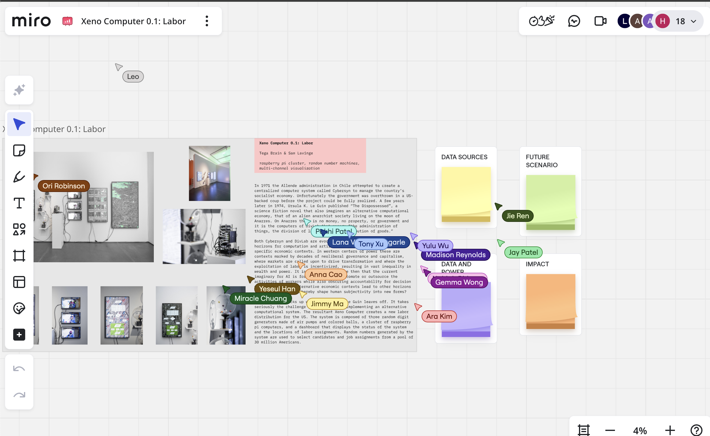
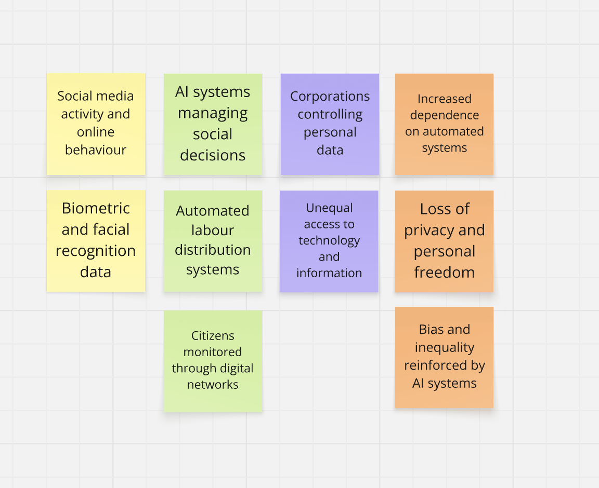
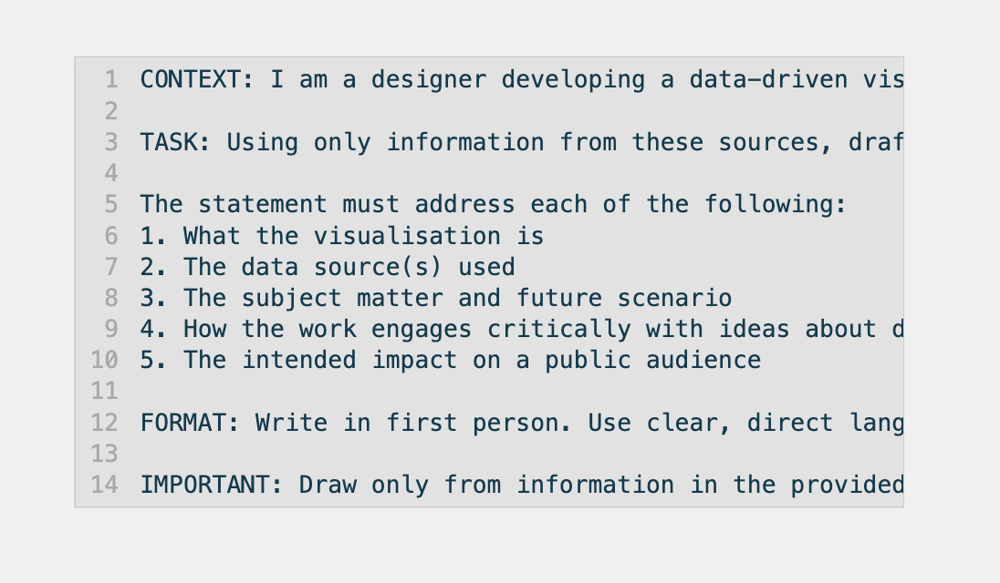
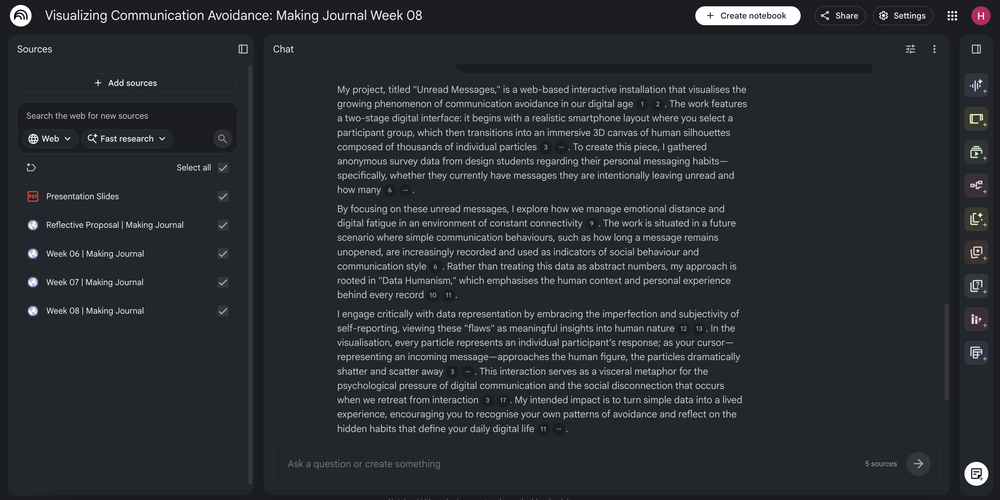
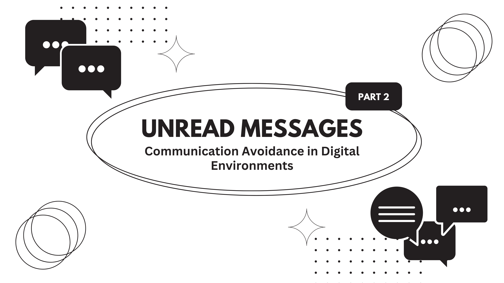
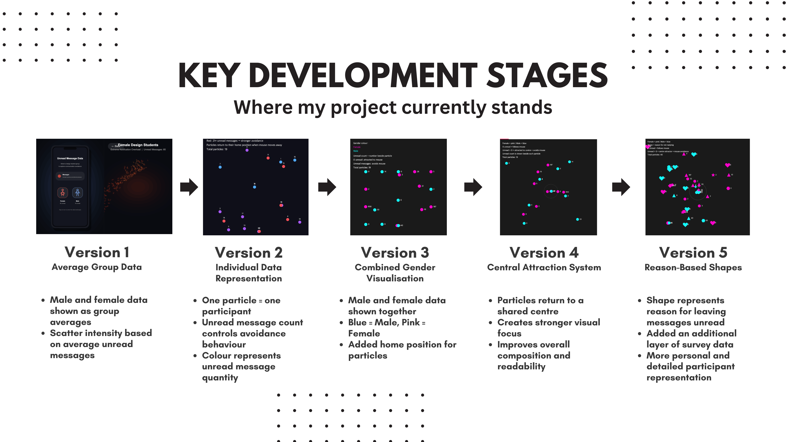
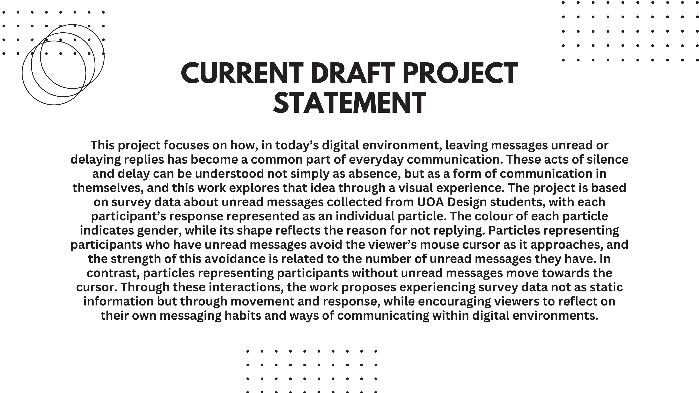
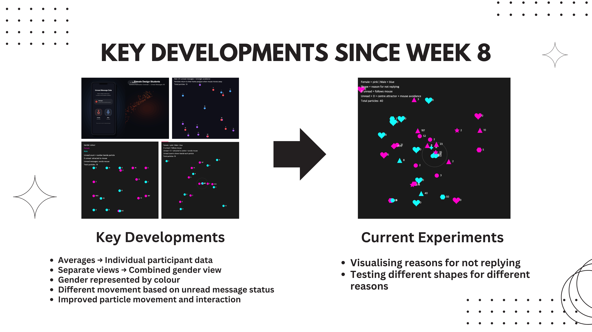
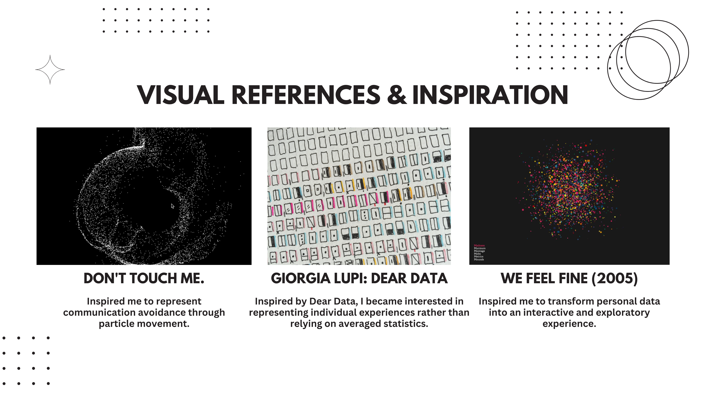

# Week 09
---

[← Back to Home](../index.md)

---

# In-Class Activities

1. Project Statement: First Draft
2. Making Sprint
3. Round Robin Rapid Reactions

---

## 1. Project Statement: First Draft

### 1.1 Case Study

During this activity, I worked with a partner to explore Xeno Computer 0.1: Labor by Tega Brain and Sam Lavigne on the Miro board. We used sticky notes to respond to the provided questions and discuss the ideas presented in the project. This helped me think more deeply about the relationship between labour, technology, and data.

 
*(Figure: Screenshot of Case Study Xeno Computer on Miro Board)*

*(Figure: Screenshot of My Notes for Case Study Xeno Computer on Miro Board)*

 

### 1.2 Drafting with NotebookLM
저는 NotebookLM을 활용하여 프로젝트와 관련된 자료들을 정리하였다. 새로운 노트북을 생성한 뒤, Reflective Proposal, 7주차와 8주차 저널, 시각적 참고 자료, 데이터 출처 관련 자료 등을 업로드하였다. 이후 수업에서 제공된 프롬프트를 활용해 프로젝트 설명문(Project Statement) 초안을 생성해보았다.

*(Figure: Template Prompt provided in the class slides)*

*(Figure: Project Statement draft generated by NotebookLM)*

 

### 1.3 Evaluation

**Strengths of the Draft:** I found that the draft generated with NotebookLM explained the overall intention and theme of the project effectively, but some parts no longer aligned with the project's current direction. In particular, the initial concept I had envisioned focused on a human figure composed of thousands of particles, whereas the project has since evolved to represent each participant’s data as a single individual particle. Therefore, I will revise the draft so that it more accurately reflects the structure and interaction methods of the current prototype.

**Areas That Need Further Development:** Although the section explaining the project’s purpose and intentions was generally accurate, the writing felt too abstract and broad. It did not sufficiently describe the specific elements that are central to the project, such as the unread message data, participant selection process, and the movement of the particles. Overall, the draft focused more on conceptual ideas than on the actual project itself, making it difficult to clearly understand what I am creating.

**Further Research and Next Steps:** I would like to further explore how communication avoidance is related to digital fatigue, managing relationships, and social expectations. I also want to find out what kinds of interactions work best when showing each participant’s data as individual particles. Another area I would like to research is how to make the data more visually interesting and easier to understand. This includes looking at how particle shape, movement, density, and connections can be used to show participants’ experiences and emotions in a clearer and more engaging way.

**Current Project Direction:** This project explores how leaving messages unread functions as a form of digital communication through an interactive particle visualisation based on survey responses, encouraging viewers to reflect on this behaviour and their own experiences.

 

### 1.4 Peer Share
Finally, I shared my draft and evaluation with a peer and exchanged feedback. After each of us spent about five minutes explaining our project, we discussed which aspects were communicated clearly and which areas could be further improved. This process helped me identify both the strengths and weaknesses of my current project and reflect on possible directions for future development.

**Feedback from Peer:**
- **What is clear and compelling?:**  "The connection between unread messages and communication avoidance is clear and interesting. I also think using particle movement as a way to represent behaviour has strong visual potential."
- **What still needs to be developed or resolved?:**  "I would like to see a stronger connection between the survey data and the interaction. It may also be useful to further explore how different participant responses can be distinguished visually."

 

---

## 2. Making Sprint

### 2.1 Sprint Planning (10 mins)

Before starting the making sprint, I reviewed the feedback and organised the main ideas into bullet points. I then used Gemini to help develop a prompt for the next stage of the project. I decided to display male and female participants together in a single view instead of separating them into different screens, making comparison easier. I also changed the colour mapping. Previously, colour represented the number of unread messages, but I reassigned it to gender: female participants are shown in pink (#ff00cc) and male participants in blue (#0efcfe). Since the unread message count is already displayed next to each particle, using colour for the same data felt unnecessary.

The main goals for this sprint were:

Represent each participant as a particle showing:
- Gender
- Whether they have unread/unanswered messages
- Number of unread/unanswered messages

*(The project also collected data on why participants did not read or reply to messages, but I have not yet found an effective way to visualise it. For now, I focused on the three data types above.)*

The planned visual mappings were:

- Background: Black (#1A1A1A)
- Gender (colour)
  - Female: Pink (#ff00cc)
  - Male: Blue (#0efcfe)
- Unread message status and quantity (movement)
  - No unread messages: attracted to the mouse cursor
  - Has unread messages: avoids the mouse cursor
  - Avoidance strength:
    - 1–5 messages: 10
    - 6–20 messages: 20
    - 21–40 messages: 30
    - 40+ messages: 50

I also wanted to test whether this interaction effectively communicates communication avoidance and explore ways to incorporate the survey responses about why messages were left unread in future iterations.

 

### 2.2 Making Sprint Progress (35 mins)

#### Prototype 1
<iframe src="https://editor.p5js.org/hyun986/full/GFdeqJ0E_" height="600" width="600"></iframe>

*(Source: Prototype 1 generated with a Gemini-generated prompt and OpenAI Codex, available on editor.p5js.org)*

#### Prototype 2
<iframe src="https://editor.p5js.org/hyun986/full/69gtYkvzN" height="600" width="600"></iframe>

*(Source: Prototype 2 developed by adding a central return behaviour, allowing particles to move back towards the centre after avoiding the cursor, available on editor.p5js.org)*

#### Prototype 3
<iframe src="https://editor.p5js.org/hyun986/full/FdGo2bGZb" height="600" width="600"></iframe>

*(Source: Prototype 3 refined by increasing the central attraction force and improving particle recovery behaviour, available on editor.p5js.org)*

 

---

## 3. Round Robin Rapid Reactions

(내꺼 사진)

### Feedback from Visitors
- "I found the concept easy to understand and the interaction felt engaging."
- "I liked how the particles reacted differently depending on the data."
- "I felt the connection between unread messages and avoidance behaviour was clear."
- "I found the movement of the particles visually interesting and fun to explore."
- "I thought the colours made it easy to distinguish between male and female participants."
- "I think it would be interesting to see how the reason for not replying data could be included in the future."
- "I felt that participants with very high unread message counts could have even stronger behaviours."
- "The project made me think about my own unread messages and communication habits."

 

### Feedback Summary and Next Steps
My prototype received positive feedback overall. Many people said they could easily understand the idea that leaving messages unread can be a form of communication and avoidance, even without much explanation. The feedback suggested that the current direction works well and should be continued. One comment that stood out was that including data about the reasons for not replying could make the project more interesting. In the next stage, I plan to explore how to present this information clearly and visually. Since most feedback was positive, I will continue developing the project in its current direction. I also plan to add one of my original ideas, changing the mouse cursor into a message icon, to make the prototype more complete.

 

---

# Independent Study

## 1. Project Development

Following on from last week, I continued collecting data and developing the project based on feedback from the making sprint and round robin sessions. In this class, I created a new prototype that changes how the data is displayed. Previously, users could only view either male or female data by selecting one gender at a time. The new prototype shows both datasets together on a single screen, making direct comparison possible. Male participants are represented in blue and female participants in pink, allowing differences between the two groups to be identified more easily.

During the Round Robin feedback session, I received positive responses about the project. Participants found the concept easy to understand and the interaction engaging. They also commented that the connection between unread messages and avoidance behaviour was communicated clearly. One key suggestion was to incorporate the survey data about “reasons for not replying,” as this could add another layer of meaning to the visualisation.

Based on this feedback, my independent study this week focused on exploring ways to integrate the reasons for not replying to data into the project. I researched possible visual representations for this dataset, organised different design options, and considered how these could be incorporated into future prototypes. I plan to test several visualisation approaches using Gemini to support the implementation process.

One approach currently being considered is representing the reasons for not replying through different icon shapes:

- No unread messages: heart shape
- Yes unread messages:
  - I forgot: circle
  - I am too busy: triangle
  - I do not know how to respond: star
  - I do not want to respond: hexagon
  - I am avoiding the conversation: square
  - Other: plus shape

<iframe src="https://editor.p5js.org/hyun986/full/zxDiTyWGk" height="600" width="600"></iframe>

*(Source: Prototype developed by adding reason-based icons to represent why participants leave messages unread, available on editor.p5js.org)*

 

## 2. Progress Report

 
*(Figure: Presentation Slide 1)*

 
*(Figure: Presentation Slide 2)*

 
*(Figure: Presentation Slide 3)*

 
*(Figure: Presentation Slide 4)*

 
*(Figure: Presentation Slide 5)*

*(Figure: Presentation Slide 6)*

---

# AI Usage Statement

- Google. (2026). Gemini [Large language model]. https://gemini.google.com

- OpenAI. (2026). Codex [AI coding model]. https://openai.com

Google Gemini and OpenAI Codex were used as coding support tools during the development of the p5.js prototype. These tools were used to generate prompts, produce example code, troubleshoot programming errors, and explore different programming approaches. All final design decisions, data mappings, code selection, refinements, and project outcomes were developed and evaluated by Hyein Yun.