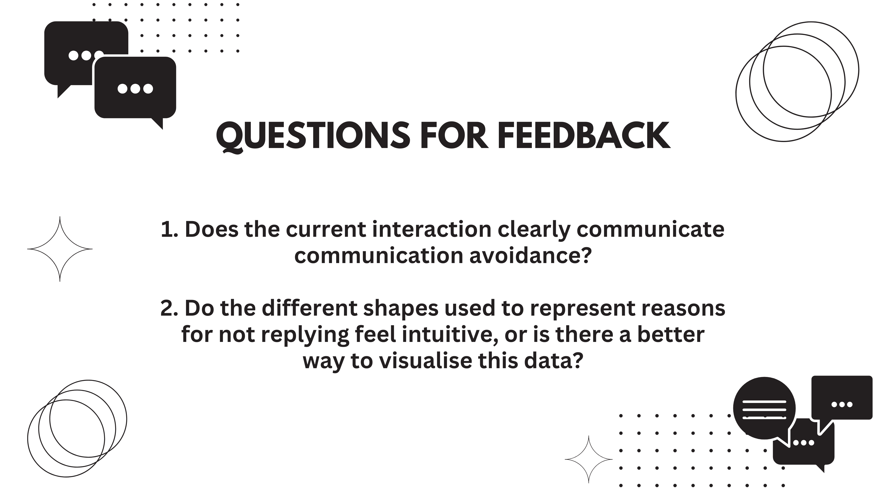
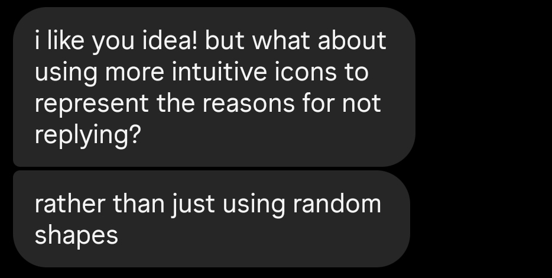
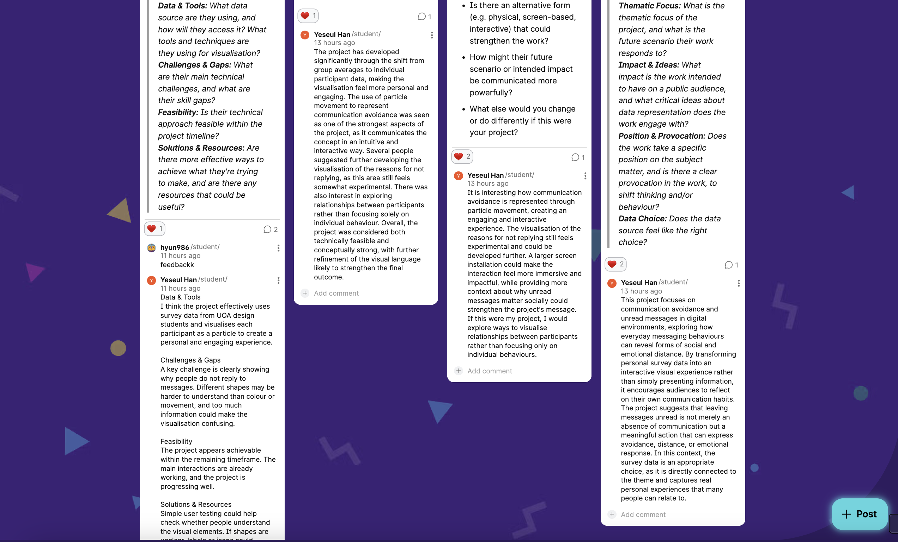
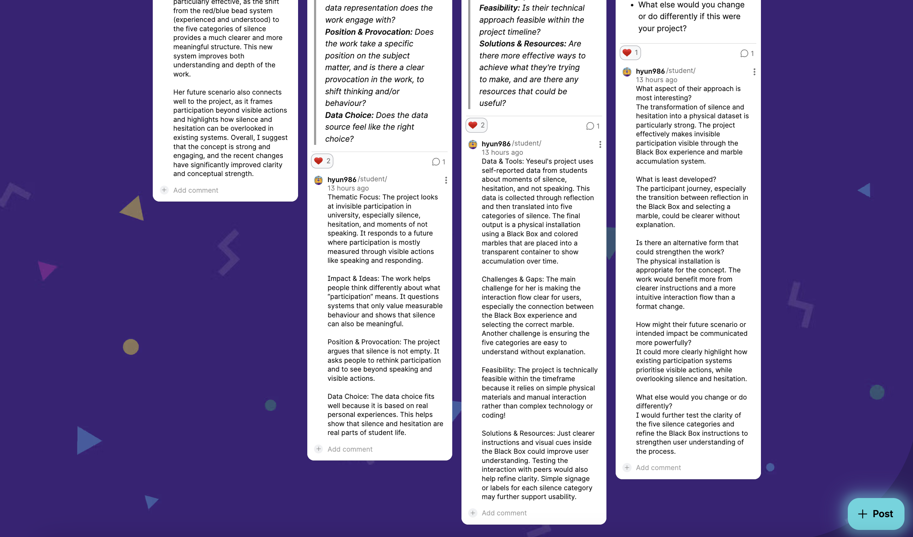
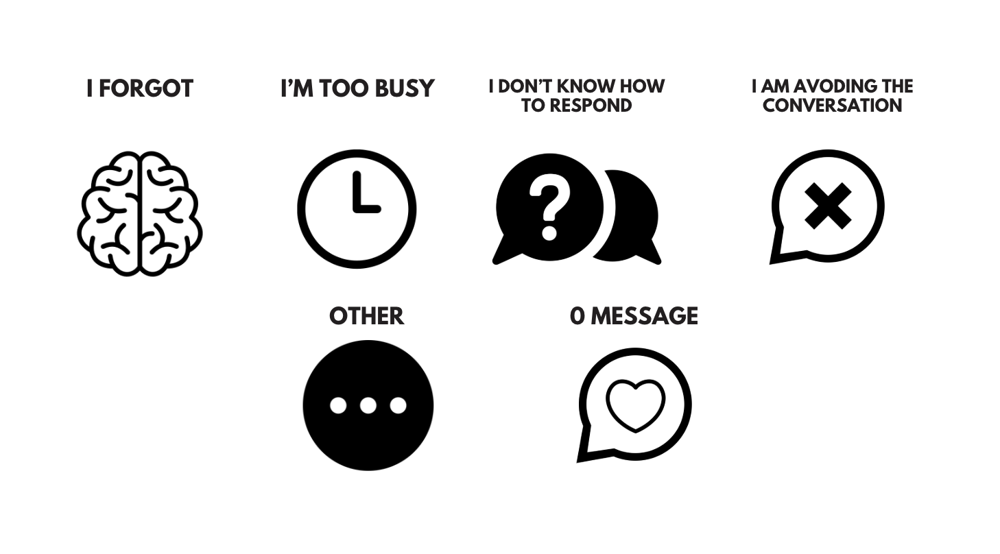
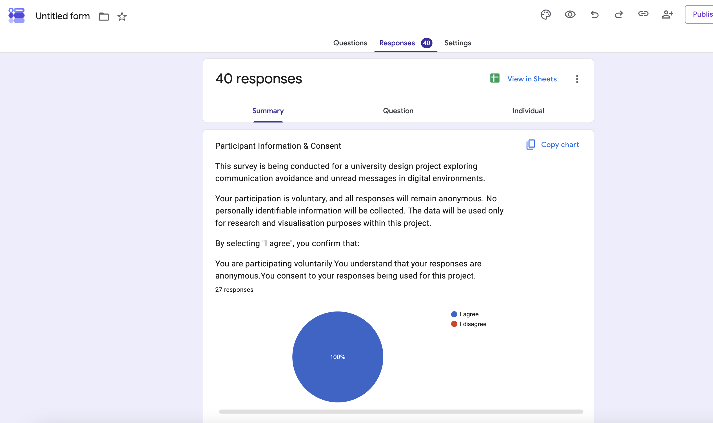

# Week 10

[← Back to Home](../index.md)

# In-Class Activities
---
I was unable to attend the Week 10 class due to illness, so I completed the in-class activities independently from home.

1. Progress Reports
2. Gallery Walk
3. Action Plan

---
## 1. Progress Reports

*(Figure: Presentation Slide 6)*

The original activity required students to share a progress report slideshow with a small group, participate in group discussions and feedback sessions, and record comments on Padlet. However, I was unable to attend class because my cold returned at the time. To catch up on the activity, I later met with my classmate Yesul and we presented our projects to each other, exchanging feedback based on a set of prepared questions.

**Feedback from Yesul:** 
After viewing my project, Yesul commented that the current direction of representing each participant's data individually was more interesting and convincing than the earlier approach of using average data. She also felt that the particle movements effectively communicated the idea of communication avoidance and that the project's intention could be understood without requiring extensive explanation. She also suggested replacing the abstract shapes currently used to represent the reasons for leaving messages unread with more intuitive icons. She believed this could help viewers understand the meaning of each reason more quickly and make the data easier to interpret. I found this suggestion particularly useful because it highlighted a way to improve the clarity of the visualisation.

This feedback also helped me realise that the project could develop beyond simply showing unread message counts and instead communicate participants' behavioural patterns and reasons for not responding in a more meaningful way.

*(While reviewing the course requirements during the final stages of the project in Week 12, I realised that I had overlooked the requirement to leave comments on Padlet. As a result, I added my feedback later than intended.)*

#### Feedback I Recieved On Padlet:

*(Figure: Screenshot of feedback I received on Padlet)*

#### Feedback I Gave On Padlet:

*(Figure: Screenshot of feedback I provided on Padlet)*

 

---
## 2. Gallery Walk
The original activity required students to visit other groups’ Padlet boards and leave comments or respond to useful feedback. However, because I was absent from class, I was unable to watch the presentations or provide detailed feedback on other students’ projects. When I reviewed the activity later in Week 12, I felt it would be difficult to leave meaningful comments without fully understanding the presentations. Instead, I explored several projects posted on Padlet, reacted with likes to the ones that interested me, and read the feedback comments left by other students. Through this process, I was reminded that creating interactive experiences that allow audiences to engage with data can often be more impactful than simply presenting the data itself. This insight connects closely with the particle-based interaction approach that I am currently developing for my own project.

*(Figure: The most useful feedback from another group)*

 

--- 
## 3. Action Plan
After discussing my project with Yesul, reviewing the feedback on Padlet, and looking at examples of strong feedback provided to other groups, I reflected on how I could further develop my project. One of the most valuable pieces of feedback was that while the project effectively visualises unread message counts and movement, it does not yet communicate enough about why participants chose not to reply. This made me realise that the project could move beyond simply visualising quantitative data and instead communicate the behavioural and emotional context behind participants’ communication habits. Based on this feedback, I plan to further explore ways of visualising the reasons for not replying. At the moment, I use arbitrary shapes to represent different reasons, but I would like to develop these into more meaningful and intuitive icons. For example, reasons such as being busy, forgetting, or avoiding a conversation could be represented through symbolic visual elements that allow viewers to understand the data more naturally without relying on additional explanations.

I also plan to experiment with an interaction that I have been considering for some time: transforming the mouse cursor into a message icon. I believe this could strengthen the connection between the user’s interaction and the themes of messaging and communication that underpin the project. In addition, I will continue refining the particle movements and visual design to improve the overall quality of the work. I am particularly interested in improving the responsiveness and behaviour of the particles, as I am not yet fully satisfied with the current motion. My goal is to create a more engaging, intuitive, and immersive interactive experience before the final showcase.

 

# Independent Study

## Project Development
- Change the cursor to a message icon
- No unread messages: message bubble with an heart shape
- Yes unread messages:
  - I forgot = brain icon
  - I am too busy = clock icon
  - I do not know how to respond = message bubble with a question mark icon
  - I do not want to respond = message bubble with an X icon
  - I am avoiding the conversation = running person or hiding face icon
  - Other = ellipsis icon 

*(Figure: Example icon designs for unread message reasons)*

<iframe width="560" height="315" src="https://www.youtube.com/embed/BTmk52v7qRA?si=a051ioRlGHx10_Bj" title="YouTube video player" frameborder="0" allow="accelerometer; autoplay; clipboard-write; encrypted-media; gyroscope; picture-in-picture; web-share" referrerpolicy="strict-origin-when-cross-origin" allowfullscreen></iframe>

*(Source: Version 1 generated using Codex)*

Based on the ideas above, I first used Gemini to create a detailed prompt and then used Codex to generate the p5.js code. The initial version used simple geometric shapes, so it was easy to run directly in p5.js. When I tried using icons to represent reasons for not replying, I ran into issues with loading and managing image files. To avoid these problems, I continued developing the prototype mainly with Codex and focused on solutions that worked reliably in p5.js.

<iframe width="560" height="315" src="https://www.youtube.com/embed/h1bgeOqq-z8?si=Vsvot3LMy8oJ4F8l" title="YouTube video player" frameborder="0" allow="accelerometer; autoplay; clipboard-write; encrypted-media; gyroscope; picture-in-picture; web-share" referrerpolicy="strict-origin-when-cross-origin" allowfullscreen></iframe>

*(Source: Version 2 with smartphone interface)*

I was inspired by the "Multitap Text" example from Week 6. Because my project focuses on unread messages, I added a smartphone-shaped frame to make the visualisation feel more like a familiar messaging environment, allowing viewers to become more immersed in the experience.

<iframe width="560" height="315" src="https://www.youtube.com/embed/sUYBluVAHV0?si=53AaBZuDLkViYyVG" title="YouTube video player" frameborder="0" allow="accelerometer; autoplay; clipboard-write; encrypted-media; gyroscope; picture-in-picture; web-share" referrerpolicy="strict-origin-when-cross-origin" allowfullscreen></iframe>

*(Source: Final version with refined smartphone interface and interaction settings)*

In the final version, I refined the smartphone interface and adjusted the sensitivity of the particle interactions. In earlier versions, avoidance behaviour was grouped into ranges such as 1–10 unread messages or 11–20 unread messages, meaning participants within the same range behaved identically. In this version, I modified the system so that each participant's movement responds to their exact unread message count. This allows every particle to behave slightly differently and makes individual differences within the dataset more visible. To prevent extremely large values from dominating the visualisation, I capped the maximum unread message value at 100. Any value above 100 is treated as the same maximum avoidance level.

 

## Data Collection Progress

*(Figure: Week 10 survey data collection progress)*

At the time of writing, I have collected survey responses from 40 University of Auckland students. I plan to continue gathering responses and incorporate additional participant data into future iterations of the visualisation.