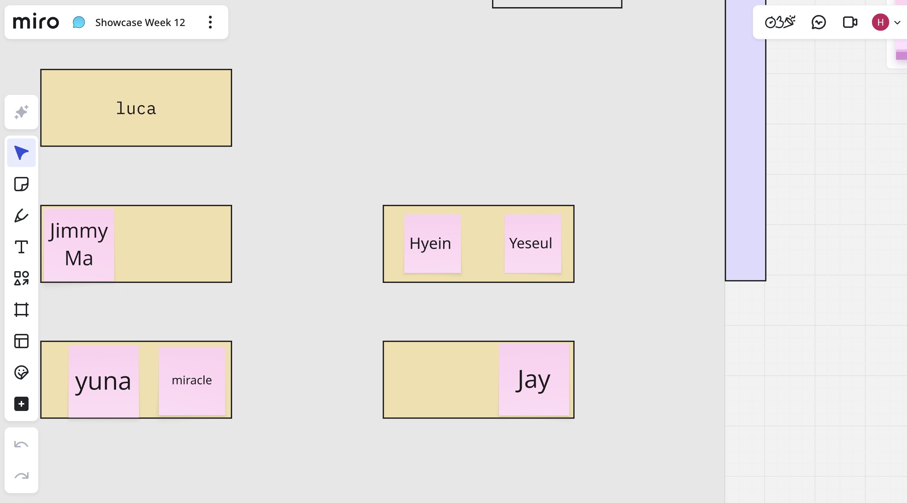

# Week 11

[← Back to Home](../index.md)

# In-Class Activities
---

## 1. Journal Review

In this activity, Yeseul and I reviewed each other’s journals and shared our project development processes. Yeseul commented that the progression of my project was clearly documented and that the development of the prototypes and visual changes were easy to follow. However, she suggested that some of the technical experiments could be explained in more detail, particularly regarding the problems I encountered and how I solved them.

After rereading my journal, I identified three key moments that significantly influenced the direction of my project:

- Deciding to move away from an Arduino-based physical outcome and focus on a web-based interactive outcome. This change allowed me to create a more accessible and flexible experience while making it easier to visualise and interact with a larger amount of data.
- Changing from averaged group data to representing each participant as an individual data point. This decision helped preserve personal differences and made the visualisation more reflective of real communication behaviours.
- Beginning to explore ways of visualising the reasons why participants do not reply to messages. Exploring this aspect expanded the project beyond simple response patterns and helped communicate the motivations and emotions behind communication avoidance.

These decisions became important turning points in shaping the current direction of the project.

 

## 2. Studio Consultation

As part of the class activity, I had an interview-style discussion with Yesul about my project. Since English is not my first language, we conducted the discussion in Korean. This allowed me to explain the project more comfortably and communicate its overall concept and intentions more clearly. During the discussion, I explained the data source, interaction design, visualisation approach, and the overall message that the project aims to communicate. Through this conversation, I gained confidence that I can clearly communicate the overall concept and direction of the project. However, I also realised that I need more preparation for situations where I will need to present or receive feedback in English. Therefore, before the week 12 class, I plan to anticipate possible questions about my project and prepare answers in English in advance. By doing so, I hope to explain the key ideas of my project more confidently and effectively.

**Tools and Techniques Used for Data Collection, Interpretation, and Visualisation:** Initially, I planned to collect unread message data from 50 DES240 students. However, I realised that obtaining a sufficiently large sample would be difficult. To collect more data, I expanded the survey to all UOA Design students and aimed to gather at least 60 responses. The anonymous survey asked participants whether they consented to participate, their gender, whether they currently had any unread messages, the number of unread messages they had, and their reasons for not replying. The visualisation was developed using p5.js. Each participant's response is represented as an individual particle, allowing personal differences to remain visible rather than being averaged into a group. During the prototyping process, I also used Codex and Gemini to assist with coding experiments and interaction development.

**Conceptual Development in Relation to Data Representation:** This project is based on unread message data collected from UOA students. Each participant's response is represented as an individual particle, allowing personal differences that might otherwise be hidden by averages to become visible. Particle colour represents gender, with male participants shown in blue and female participants shown in pink. Particle shape represents the participant's reason for not replying. For example, reasons such as being busy, not knowing how to respond, or intending to reply later are visualised using different shapes. The interaction is also directly connected to the data. Particles representing participants with no unread messages are attracted to the viewer's mouse cursor, while particles representing participants with unread messages avoid the cursor as it approaches. The greater the number of unread messages, the stronger the avoidance behaviour becomes. Through this movement, I aim to communicate unread messages and communication avoidance as an experience rather than simply presenting them as statistical information. The project is also informed by the principles of Data Humanism. Rather than focusing on averages or group-level representation, I am interested in highlighting individual experiences and personal contexts. I want the data to be understood not as abstract numbers but as information connected to people's behaviours, decisions, and emotions. Instead of relying on text or graphs, I explore how movement and interaction can communicate the human experiences behind the data.

**Challenges and Solutions:** One of the biggest challenges was deciding how to represent the data. Initially, I considered using average values to compare male and female groups. However, this approach removed many of the individual differences that I felt were important to the project. To address this issue, I changed the visualisation so that each participant is represented as an individual particle rather than as part of an averaged dataset. Another challenge was finding an effective way to visualise the reasons why participants do not reply to messages. This remains an area that I am continuing to develop and experiment with.

**What I Learned:** One of the most important things I learned from this project was that data visualisation is not simply about collecting and presenting information, but also about interpreting and communicating it creatively. I developed skills in using AI-assisted coding workflows as well as creating interactive data visualisations with p5.js. I also learned the importance of feedback throughout the design process. By repeatedly testing and revising different visualisation approaches, I was able to identify more effective ways of communicating the data. This helped me understand that successful data visualisation requires not only technical skills but also creative thinking and continuous iteration. During the early stages of the project, I also experimented with Arduino and explored the possibility of creating a physical interactive outcome. Although this exploration remained at a basic level and was not pursued further, it helped me think about the relationship between digital data and physical interaction.

**Intended Impact of the Final Data Visualisation:** The aim of this project is to provide an intuitive overview of unread and unanswered message behaviours among UOA students. Viewers can interact with individual data points by moving the mouse, allowing them to explore participants' messaging habits and communication behaviours directly. The visualisation also allows viewers to compare who has more unread messages and examine the different reasons participants give for delaying or avoiding replies. Through this process, I hope audiences will begin to see unread messages and communication avoidance not only as negative behaviours, but also as forms of communication that occur within digital environments. Ultimately, the project aims to go beyond simply presenting data and instead encourage viewers to reflect on their own messaging habits, digital fatigue, communication avoidance, and the ways they manage relationships within contemporary digital environments.

 

## 3. Showcase Planning

For the final showcase, I plan to present the work on a computer screen. Since the project is an interactive data visualisation that relies on viewers moving the mouse and directly interacting with the particles, I believe it is important to provide an environment where audiences can actively engage with the work. The visualisation will run on a computer or laptop, allowing visitors to explore the data through interaction rather than simply viewing a static outcome. This approach enables audiences to experience communication avoidance behaviours directly while interacting with the dataset. I also plan to display a short project statement and brief instructions alongside the work so that viewers can easily understand both the concept and the interaction. Before the showcase, I will continue refining the particle movement and visual elements to create a more intuitive and immersive experience.

(figures: 위크 12 쇼케이스내자,리)